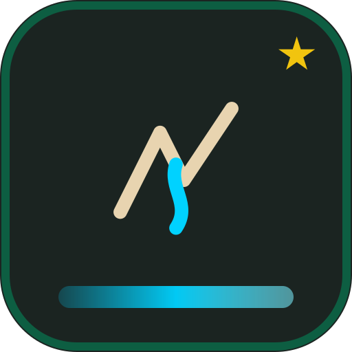

<div align="center">
  
  &nbsp;&nbsp;
  
</div>

<h1 align="center">聆涧 · LingJian（VoiceStream）</h1>

<p align="center">
  <strong>耳畔清涧，一字生境</strong><br/>
  <em>A clear gully at the ear; one word makes a scene.</em>
</p>

<p align="center">
  
  
  
  
</p>

<p align="center">
  <b>鹿溪联合创新实验室</b>（LUXI Joint Innovation Lab）出品 · 知行（耳·境）<br/>
  仓库：<a href="https://github.com/itrilogy/LUCY-LINGJIAN">itrilogy/LUCY-LINGJIAN</a>
</p>

---

本机循环的环境声混音器。单轨或整类随机、混音无时限；播放页按场景浮现金句。曲库「此时·此刻·此地」按当地天气与时辰命中标签，随机组混并配静帧、动效与一句诗。

## 🚀 快速开始

```bash
npm install
npm run dev
```

打开 http://127.0.0.1:5173

默认绑定 `127.0.0.1`。Apple Comfort Sounds 仅供个人本机播放；素材随仓库公开（完整音频位于 `asset/Sounds/`），请遵守素材来源的许可与使用条款。

## 🎨 品牌标识

| 标识 | 预览 | 说明 | 源文件 |
| :---: | :---: | :--- | :--- |
| **产品方标** |  | 山涧溪流 + 声波意象（鹿溪绿底） | `public/brand/lingjian-mark.svg` |
| **产品字锁** | [`public/brand/logo.svg`](public/brand/logo.svg) | 横版产品字锁 | `public/brand/logo.svg` |
| **实验室主标** |  | 官方 LUXI LAB | `public/brand/luxi-lab-main.svg` |

**色板（LUXI CI）**

| Token | 色值 | 用途 |
| :--- | :--- | :--- |
| 鹿溪绿 | `#0D5E42` | 主色 / 图标底板 |
| 源启白 | `#F5F7FA` | 浅色背景 / 反白 |
| 进化蓝 | `#00D2FF` | 溪流 / 数据高亮 |
| 标题金 | `#F1C40F` | 落点 / 显著信号 |

品牌上线副本：[`public/brand/`](./public/brand/README.md)。笔记库归档目录名为 `聆涧-LingJian-品牌资产`（Obsidian `departments/lab`，路径随库根而变）。

## 📚 文档

正式件在 [`docs/`](./docs/README.md)：

| 文档 | 说明 |
| :--- | :--- |
| [软件著作权登记材料说明](./docs/00-软件著作权登记材料说明.md) | 申请表字段与权属 |
| [软件需求规格说明书](./docs/01-软件需求规格说明书.md) | 需求基线 |
| [软件设计说明书](./docs/02-软件设计说明书.md) | 架构与模块 |
| [用户使用手册](./docs/03-用户使用手册.md) | 安装与操作 |
| [软件鉴别材料说明](./docs/04-软件鉴别材料与源程序说明.md) | 源程序首尾页抽取 |

---

<div align="center">
  
  <p><strong>聆涧 · LingJian</strong> · 耳畔清涧，一字生境</p>
  <p>© 鹿溪联合创新实验室 · LUXI Joint Innovation Lab</p>
  <p><em>林深见鹿，源启清溪 · Deep Insights, Evolutionary Origin.</em></p>
</div>
