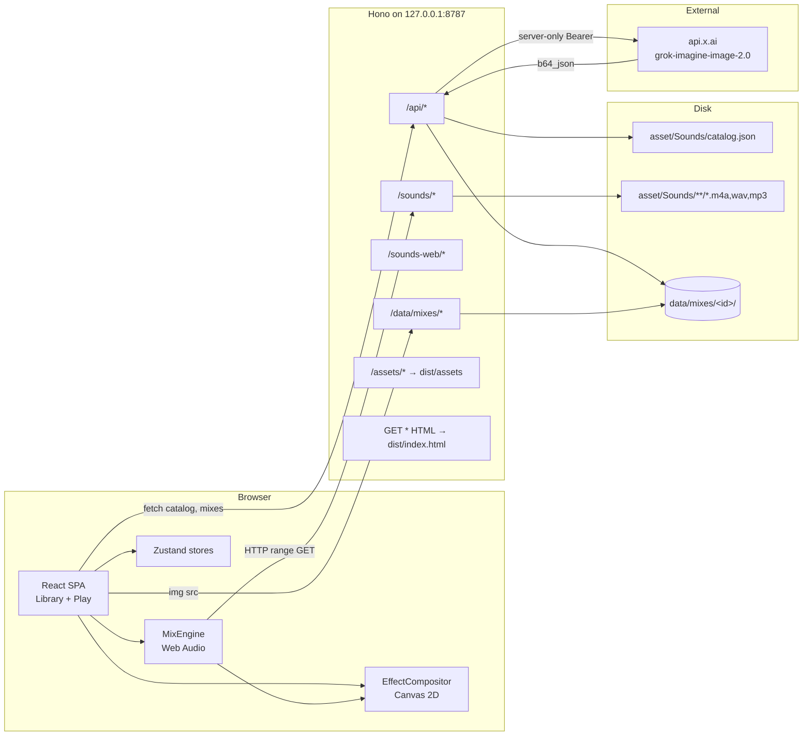
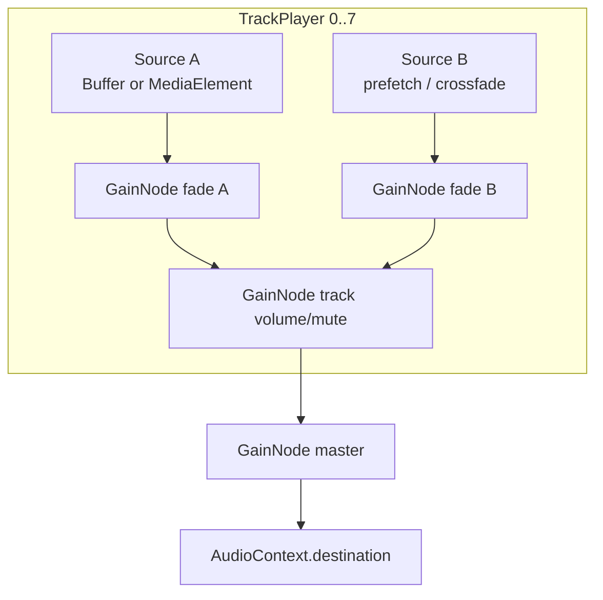
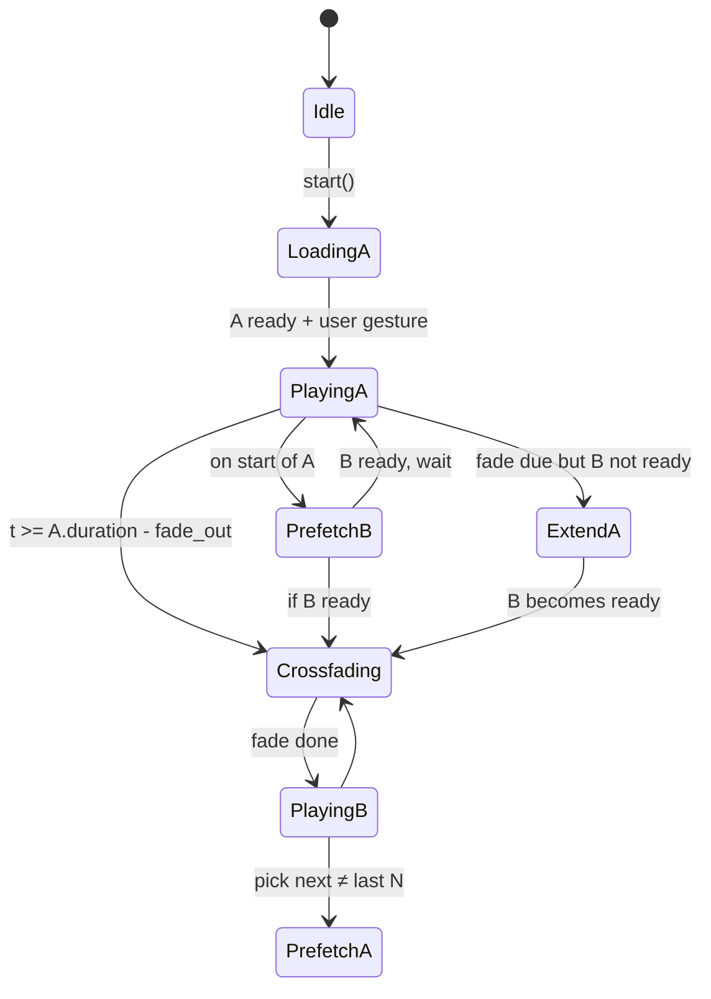

# VoiceStream v1 — Background Sound Mix Site（工程设计底稿）

> **正式交付文档**（软著 / 软件工程范式）见同目录：  
> [文档总览](./README.md) · [需求规格说明书](./01-软件需求规格说明书.md) · [软件设计说明书](./02-软件设计说明书.md) · [用户使用手册](./03-用户使用手册.md) · [著作权登记材料](./00-软件著作权登记材料说明.md)  
> 本篇保留为实现过程中的英文工程底稿，条目以正式中文说明书为准。

---

# VoiceStream v1 — Background Sound Mix Site

| Field | Value |
|---|---|
| **Title** | VoiceStream v1: local-first web mixer for classified comfort sounds |
| **Author** | VoiceStream engineering |
| **Date** | 2026-08-25 |
| **Status** | Draft — open questions resolved |
| **Workspace** | `/Users/ic/Project/VoiceStream` |
| **Audience** | Senior engineers implementing the first application code in this repo |

---

## Overview

VoiceStream is a greenfield local-first website that plays and mixes the already-organized comfort-sound library under `asset/Sounds/` (87 files, 531,798,981 bytes ≈ 507 MiB). There is **no application source yet**. The product is a two-surface web app: a sparse **library / mix-config** page and a full-viewport **play** page. A mix is a list of tracks; a track is either one file or an entire category. Category tracks shuffle through the category, prefetch the next file, and crossfade with per-track fade durations. Mixes can be saved and reloaded. The play-page background is **never generated at runtime**: a pre-built library of 30 cinematic stills under `asset/Backgrounds/` is selected by **tag hit** from the current file / category / scene set. A canvas light layer (vignette, slow Ken Burns, audio-ish equalizer, category particles) sits on top of the still.

The browser audio engine is Web Audio API with a **hybrid source strategy**: `AudioBufferSourceNode` for short loopable clips (sample-accurate loops after AAC priming trim) and `MediaElementAudioSourceNode` for the handful of 10–30 minute files that must not be fully decoded into PCM. A thin Hono server binds to `127.0.0.1`, serves `asset/Sounds` and `asset/Backgrounds` in place (never copied into `public/`), and persists mixes as JSON on disk.

**Critical asset finding (verified with ffprobe, 2026-08-25):** `catalog.json` labels all `.m4a` files as `"format": "alac"`, but every one of the 84 `.m4a` files is actually **AAC-LC** (`codec_name=aac`, profile LC, `mp4a.40.2`, 48 kHz stereo, ~256 kbps). ALAC is **not** present in the current tree. This is good for browsers (AAC-LC in MP4 is universal). A transcode pipeline is still designed as a **guard** so a future ALAC file cannot silently break Chrome/Firefox.

---

## Background & Motivation

### Current state

The repo contains only organized audio assets:

```
asset/Sounds/
  catalog.json                 # machine-readable catalog — app MUST use this
  背景音文件清单.md              # human inventory
  noise/     4 files   噪音类
  traffic/   4 files   交通出行类
  fire/      13 files  篝火
  rain/      18 files  雨声
  ocean/     17 files  海浪
  stream/    21 files  溪流/蒸汽
  night/     7 files   夜晚
  thunder/   3 files   雷雨
```

`catalog.json` (`version: 1`) is the authority for ids, paths, bilingual labels, `variant_group`, and recommended play-page `effect` ids. The Markdown file is documentation only.

There is no `package.json`, no server, no UI. macOS Comfort Sounds were copied from `/System/Library/AssetsV2/com_apple_MobileAsset_ComfortSoundsAssets/` and supplemented with three thunder recordings (one CC0 WAV, two free MP3s).

### Pain points this design solves

1. **Classification is done; playback is not.** The catalog exists; nothing consumes it.
2. **A single loop is not enough.** Fire/Rain/Ocean/Stream are variant pools. Playing one file forever is less interesting than shuffling a category with crossfades.
3. **507 MiB cannot be decoded up front.** Fully decoding the library to 32-bit float PCM would be ~5.9 GiB. QuietNight alone is ~668 MiB of PCM.
4. **Catalog `format` is wrong.** Treating files as ALAC would trigger an unnecessary transcode of 500 MiB and miss the real loop-gap problem, which is AAC encoder delay (Apple priming = 2112 samples).
5. **Atmosphere images need a secret.** Image generation cannot live in the browser bundle.

### Why a website first

The requirement is explicit: v1 is a website runnable via `npm run dev` / `npm run build` on a laptop. No accounts, no cloud sync, no native wrapper. Local bind + personal-use banner keeps Apple-asset licensing in a defensible box. **Any future public deploy MUST drop the Apple `.m4a` tree** and substitute redistributable CC0 (or similarly licensed) beds — that swap is a later product, not a v1 PR.

---

## Goals & Non-Goals

### Goals (v1 — all in scope)

- Play any single catalog file, looped, from a full-viewport play page.
- Play a **mix** of up to **8 concurrent tracks**.
- A track is `kind: "file"` or `kind: "category"`.
- Category tracks: uniform random over the category **shuffle pool** (see K16 / §3). `variant_group: null` members **stay in** the pool (`rainonroof`, `steam`, all three thunder files). **`quietnight` is not in any category pool** — it is a standalone scene. While the current file plays, pre-pick and prefetch the next file; avoid immediate repeat when pool size > 1; crossfade with per-track `fade_in_ms` / `fade_out_ms`.
- **Standalone scene「安静的夜晚」** (`quietnight`): own library card, addable only as `kind: "file"`, playable at `/play/file/quietnight`. File stays at `asset/Sounds/night/QuietNight.m4a`. Always-stream. Effect `fireflies`.
- Per-track volume and mute; master volume.
- Save / list / load / delete mix configs (filesystem JSON).
- Play-page background from the pre-generated tagged library (`asset/Backgrounds/catalog.json`). Matching is deterministic tag-hit, not an API call.
- Category-keyed visual effects overlaid on the still (`grain`, `parallax`, `embers`, `raindrops`, `waves`, `ripples`, `fireflies`, `lightning`) plus a faint player light layer (Ken Burns, vignette, breathing bloom, thin equalizer).
- Chinese-first UI (`label_zh`), English secondary (`label_en`).
- Serve `asset/Sounds` and `asset/Backgrounds` without copying them into `public/`.

### Non-Goals (v1)

- Native apps, mobile app stores, iOS/Android wrappers.
- **DSP-synthesized** noise (oscillators, filtered white noise). White/Pink/Brown already exist as files (`whitenoise`, `pinknoise`, `brownnoise`). Park a `NoiseOscillator` behind a v2 flag if desired; do not build it now.
- User accounts, auth, cloud sync, multi-device mix sharing.
- Runtime / on-demand AI image generation (xAI Imagine or otherwise). Backgrounds are pre-enumerated stills + tag matching.
- Video generation (xAI Imagine video is out of scope).
- Offline PWA that packages all 507 MiB.
- Public internet deployment of the **Apple Comfort Sounds `.m4a` tree**, reverse proxy, HTTPS termination. Default bind is `127.0.0.1`. A future public site is allowed only after the Apple files are **removed** and replaced with CC0 (or similarly licensed) beds — see § Legal “Public-deploy substitution”. That substitution is **not** a v1 PR.
- Moving `QuietNight.m4a` on disk, or adding `exclude_file_ids` to the mix schema. The standalone-scene split is catalog/runtime metadata.
- Spatial audio, EQ, compressor, per-track FX rack, timeline DAW.
- Editing or re-encoding the original Apple files in place.
- Shipping a mobile-compact layout as a hard requirement (desktop-first; a single-column library is fine but not pixel-perfect mobile).

---

## Key Decisions

| # | Decision | Rationale |
|---|---|---|
| K1 | **Vite 6 + React 19 + TypeScript + Hono (Node)**, not Next.js | Two pages, a static asset tree that must not enter a bundler, and one secret-bearing API. Vite serves the SPA; Hono serves `/sounds`, `/api`, and `/data`. Next.js would fight the 507 MiB tree and add App Router ceremony for no benefit. |
| K2 | **Serve `asset/Sounds` in place** at `/sounds/*`. Never copy into `public/` | 507 MiB duplication would bloat git-adjacent build dirs and `vite build`. Range requests are required for QuietNight; set `Accept-Ranges` / `Cache-Control` in `serveStatic` `onFound` (library does not send them on a 200). |
| K3 | **Hybrid Web Audio sources**: buffer short loops, stream long / fat files | `AudioBufferSourceNode.loop` is the only reliable gapless loop. `decodeAudioData` on QuietNight (~668 MiB PCM) is unacceptable. **Always-stream** if `duration_sec ≥ 200` OR `bytes ≥ 15_000_000` OR `pcm_bytes > 64 MiB` (`pcm_bytes = duration_sec * sample_rate * channels * 4`). |
| K4 | **No ALAC transcode of the current tree**; keep a **guard pipeline** | ffprobe: 84× AAC-LC, 2× MP3, 1× PCM WAV. AAC-LC in `.m4a` plays in Chrome, Firefox, Safari, Edge. `scripts/prepare-assets.ts` probes codecs and transcodes only if ALAC (or another non-web codec) appears. |
| K5 | **Mix persistence = filesystem JSON via the thin server** (`data/mixes/<id>/mix.json`). IndexedDB is a **read-through cache** of the last mix only | Mixes are grep-able JSON. Play backgrounds do not live next to mixes; they are a shared tagged library. |
| K6 | **Play-page progress is a session timer** for mixes; file-relative for single-file play | A mix of looping/crossfading tracks has no shared “song length”. Lying with the loudest track’s position is worse than an honest elapsed clock. |
| K7 | **Effect compositor overlays all unmuted tracks**, intensity weighted by track volume, with a global particle budget | Multi-category mixes should feel like rain *and* fire, not a hard switch. Cap work so 8 tracks cannot spawn 8× particles. |
| K8 | **Pre-generated tagged stills, no runtime image gen** | 31 stills in `asset/Backgrounds/` (categories + QuietNight + Drive/醒律 + common 2-tag mixes). `matchBackground(tagsFromPlay(tracks))` scores hit/extra/missing then **weighted-random** among positive scores; `defaults` are a bonus / last resort, not a lock. Overlay light is CSS + Canvas, not a new bitmap. |
| K9 | **Bind `127.0.0.1`, personal-use banner; v1 is not a public site** | Apple Comfort Sounds are not licensed for redistribution. Thunder WAV is CC0; two OFS MP3s need attribution. **Future public deploy (chosen path):** drop the Apple `.m4a` tree and substitute CC0 beds. Keep LegalGate + loopback + README “do not push Apple m4a to a public remote” in v1. No v1 asset-swap PR. |
| K10 | **Equal-power (cosine) crossfade**; if next file is not ready, **extend current** (loop/continue) then fade | Prevents a silence hole on slow prefetch of long stream files (Night_1–6, 10-min beds, or QuietNight when it is an explicit file track). |
| K11 | **Zustand + react-router-dom**, no Redux, no CSS framework beyond a tiny design token file | Two screens. A component library would densify the UI against the “extremely minimal” requirement. |
| K12 | **Enrich catalog at prepare-time** into `src/catalog/catalog.runtime.json` (committed). Do not rewrite `asset/Sounds/catalog.json` | Source catalog remains the human/asset authority for ids and labels. Runtime file adds `codec`, `duration_sec`, `encoder_delay_samples`, `playback: "buffer" \| "stream"`. Clone-and-dev does **not** require ffprobe because the runtime JSON is committed. |
| K13 | **Connected decoded-PCM budget is 256 MiB; prefetch is a replacement, not an add** | Eight largest *bufferable* files still sum to ~474 MiB (Appendix B). A **new track** buffers only if `connected + pcm(new) ≤ 256`. A **category prefetch** on a track that already holds buffer A buffers B if `connected - pcm(A) + pcm(B) ≤ 256` (steady state after `T_out`). Transient A+B overlap on that one track may overshoot to `256 + 64` MiB until `T_out`. Never evict a playing buffer; never refuse the 8th track. The engine **must** call `playbackMode` at decode/prefetch time — do not branch only on `catalog.runtime.json` `playback`. |
| K14 | **Client mints mix and track ULIDs; PUT merges atmosphere; drafts may have 0 tracks** | Client generates the mix id on first add-track / 保存; `PUT /api/mixes/:id` body.id must match the URL (else 422). Server PUT **does not** drop `atmosphere_image` unless the client sends `null` explicitly. `tracks.min(0)` so the empty library state can exist; Play and autosave require ≥ 1 track. |
| K15 | **Prod Hono SPA fallback + `/sounds-web`** | Deep links `/play/...` must return `dist/index.html`. Mount `/sounds-web/*` for the ALAC-guard output even when empty. |
| K16 | **`QuietNight` is a standalone scene, not a Night variant** | User: 「静夜 这个文件单独；是一个独立场景」. Disk path stays `night/QuietNight.m4a`. Category `night` shuffle = `Night_1`–`Night_6` only (`variant_group === "night"`). Library shows a sibling scene card「安静的夜晚」. Mixes add it as `kind: "file"`. Effect remains `fireflies` (calmer: compositor intensity from the single track, no extra particles). No `exclude_file_ids` on the mix schema. |

---

## Proposed Design

### 1. System architecture



Dev: Vite (`server.host: "127.0.0.1"`, `:5173`) proxies `/api`, `/sounds`, `/sounds-web`, `/data` to Hono (`:8787`). Prod `npm run start` is Hono alone: API and static prefixes first, then hashed `/assets/*` from `dist/`, then **SPA fallback** `GET *` with `Accept: text/html` → `dist/index.html` so `/play/file/:id` refresh does not 404. `npm run dev` is `concurrently -n web,api "vite" "tsx watch --tsconfig tsconfig.server.json server/index.ts"`. Both processes bind `127.0.0.1`; if `HOST` is not loopback and `VOICESTREAM_BIND_LAN` is not `1`, `server/index.ts` `process.exit(1)`.

### 2. Repository layout (to be created)

```
VoiceStream/
  asset/Sounds/                 # existing; never bundled
  data/mixes/                   # gitignored user mixes
  data/presets/                 # committed starter mixes
  docs/design.md
  public/                       # favicon + fallback CSS only; no audio
  scripts/prepare-assets.ts     # ffprobe enrich + ALAC guard transcode
  server/
    index.ts                    # Hono entry, bind 127.0.0.1
    catalog.ts
    mixes.ts
    atmosphere.ts
    static.ts
  src/
    main.tsx
    App.tsx                      # router layout + LegalGate wrapper (all routes)
    pages/LibraryPage.tsx
    pages/PlayPage.tsx
    audio/
      MixEngine.ts
      TrackPlayer.ts
      BufferSource.ts
      StreamSource.ts
      shuffle.ts
      decode.ts
      memory.ts
    catalog/types.ts
    catalog/catalog.runtime.json  # committed; do not require ffprobe to boot
    mix/store.ts
    effects/
      compositor.ts
      grain.ts
      parallax.ts
      embers.ts
      raindrops.ts
      waves.ts
      ripples.ts
      fireflies.ts
      lightning.ts
    api/client.ts
    i18n/zh.ts
    i18n/en.ts
    styles/tokens.css
  shared/
    mixSchema.ts                # zod; extensionless relative imports (see §6)
  .env.example
  .gitignore
  package.json
  vite.config.ts
  tsconfig.json
  tsconfig.server.json
```

`.gitignore` must include `data/mixes/`, `.env`, `node_modules/`, `dist/`, `asset/SoundsWeb/` (transcode output, only created if ALAC appears).

### 3. Catalog consumption

On boot the SPA fetches `GET /api/catalog`, which returns:

```ts
type Catalog = {
  version: 1;
  runtime_version: 1;
  source: string;
  root: "asset/Sounds";
  file_count: 87;
  total_bytes: 531798981;
  categories: Category[];
  scenes: StandaloneScene[];  // runtime-only; v1: QuietNight
  files: CatalogFile[];
};

type StandaloneScene = {
  id: "quietnight";          // equals file.id
  file_id: "quietnight";
  label_zh: "安静的夜晚";
  label_en: "Quiet Night";
  description_zh: "长时长独立场景，不是夜晚变体";
  effect: "fireflies";
  sort: 7.5;                 // library rail: after 夜晚 (7), before 雷雨 (8)
};

type Category = {
  id: "noise" | "traffic" | "fire" | "rain" | "ocean" | "stream" | "night" | "thunder";
  label_zh: string;
  label_en: string;
  description_zh: string;
  effect: EffectId;
  sort: number;
};

type EffectId =
  | "grain" | "parallax" | "embers" | "raindrops"
  | "waves" | "ripples" | "fireflies" | "lightning";

type CatalogFile = {
  id: string;
  filename: string;
  path: string;          // e.g. "rain/Rain_1.m4a"
  url: string;           // "/sounds/rain/Rain_1.m4a"
  category: Category["id"];
  label_zh: string;
  label_en: string;
  format: string;        // catalog.json value, possibly "alac" (stale)
  codec: "aac" | "mp3" | "pcm_s16le" | "alac" | string;
  bytes: number;
  duration_sec: number;
  sample_rate: number;
  channels: number;
  encoder_delay_samples: number;   // 2112 for Apple AAC; 0 for wav
  encoder_padding_samples: number; // from iTunSMPB remainder
  playback: "buffer" | "stream";
  variant_group: string | null;
  standalone_scene: boolean; // true only for quietnight in v1
  license?: string;
  source?: string;
};
```

**Do not invent modules that read the Markdown inventory.** Only `catalog.json` + the runtime enricher. **Do not rewrite** `asset/Sounds/catalog.json` (K12). PR 2 writes `standalone_scene` and `scenes[]` onto `catalog.runtime.json` only.

**Shuffle pool** for `kind: "category"` / `target_id`:

```ts
function categoryPool(categoryId: Category["id"], files: CatalogFile[]): CatalogFile[] {
  return files.filter(f => f.category === categoryId && !f.standalone_scene);
}
```

| Category | In the pool | Out of the pool |
|---|---|---|
| `rain` | Rain_1–17 **and** `rainonroof` (`variant_group: null`) | — |
| `stream` | Stream_1–20 **and** `steam` | — |
| `thunder` | all three thunder files | — |
| `night` | **Night_1–Night_6 only** (`variant_group === "night"`) | **`quietnight`** (`standalone_scene: true`) |
| others | every file with that `category` | — |

`quietnight` is **not** a mix-schema exclude list. It is a catalog-level scene split. Users add it as `kind: "file", target_id: "quietnight"` or play `/play/file/quietnight`. Physical path remains `asset/Sounds/night/QuietNight.m4a` (do not move the file).

### 4. Verified asset facts (ffprobe, all 87 files)

| Category | N | Codec | Duration range | Notes |
|---|---:|---|---|---|
| noise | 4 | AAC-LC 48 kHz | 60 s – 600 s | Short noise ~2 MB; `babble` 10 min / 18.6 MB |
| traffic | 4 | AAC-LC 48 kHz | 585 s – 1081 s | All long. `train` 18.0 min / 33.3 MB |
| fire | 13 | AAC-LC 48 kHz | 60 – 143 s | All bufferable under 64 MiB PCM (Fire_13 ≈ 52.4 MiB). Variant group `fire` |
| rain | 18 | AAC-LC 48 kHz | 70 – 600 s | 17 variants + `rainonroof` 10 min |
| ocean | 17 | AAC-LC 48 kHz | **59.67 – 186.69 s** | Most variants buffer; `ocean_8` / `ocean_2` always-stream on PCM > 64 MiB |
| stream | 21 | AAC-LC 48 kHz | 87 – 600 s | 20 variants ~120 s / ~44 MiB PCM (buffer); `steam` 10 min (stream) |
| night | 6+1 | AAC-LC 48 kHz | Night_1–6: **237.59 – 314.58 s**; QuietNight **1822.76 s** | Shuffle pool = Night_1–6 (all stream). **QuietNight is a standalone scene** (30.38 min / 56.9 MB / ~668 MiB PCM, always-stream, `fireflies`) |
| thunder | 3 | wav PCM 44.1k + mp3 | 42.77 / 128.81 / **225.75 s** | WAV + short MP3 buffer; **`thunder-urban-rain` streams** (226 s). WAV CC0; MP3s free with attribution |

**Always-stream files** (K3, 17 files — `playbackMode()` is the source of truth; this list is generated from it in PR 2):

- Duration/bytes (15): `quietnight`, `train`, `rainonroof`, `steam`, `babble`, `airplane`, `boat`, `bus`, `night_1`…`night_6` (all ≥ 237.59 s), **`thunder-urban-rain` (225.75 s)**.
- PCM > 64 MiB (2 more, both < 200 s): `ocean_8` (186.69 s, ~68.4 MiB PCM), `ocean_2` (176.43 s, ~64.6 MiB PCM).

`thunder-urban-storm` (128.81 s, ~43.3 MiB PCM) and `thunder-heavy-rain` (42.77 s WAV, ~14.4 MiB PCM) **buffer**.

**Apple AAC priming:** every probed `.m4a` has `start_pts = 2112` and iTunSMPB delay `0x840 = 2112` samples ≈ 44 ms at 48 kHz. This is the gapless-loop hazard, not ALAC.

### 5. Audio engine

#### 5.1 Graph



Lightning’s `AnalyserNode`, if enabled, taps **that thunder track’s `TG`**, never the master bus. A rain+thunder mix must not flash on rain transients. If the mix has no thunder track, skip the analyser and keep Poisson-only flashes.

- One `AudioContext` per page session, created **inside the click/keydown handler** that starts playback (`new AudioContext()` + `resume()`). Never construct it at module load.
- Master gain default `0.8`. Track gain default `0.7`. Mute sets track gain to `0` **without stopping** the source so unmute is instantaneous.
- Hard cap: `MAX_TRACKS = 8`. The mixer UI refuses to add a 9th. During a category crossfade a track uses two sources; peak node count ≈ `8 * 2 + 8 + 1 = 25` AudioNodes — trivial.
- Sample rate: let the context use the hardware rate (usually 48 kHz, matching the AAC files). Do not resample in JS.

#### 5.2 Source selection

```ts
function pcmBytes(file: CatalogFile): number {
  return file.duration_sec * file.sample_rate * file.channels * 4; // float32
}

const PCM_ALWAYS_STREAM = 64 * 1024 * 1024;      // 64 MiB
const PCM_CONNECTED_BUDGET = 256 * 1024 * 1024;  // 256 MiB
const PCM_OVERLAP_HEADROOM = 64 * 1024 * 1024;   // one-track A/B fade overshoot

type PlaybackIntent =
  | { kind: "new-track" }
  | { kind: "prefetch"; replacing: CatalogFile }; // A is currently connected on this track

function playbackMode(
  file: CatalogFile,
  connectedPcmBytes: number,
  intent: PlaybackIntent = { kind: "new-track" }
): "buffer" | "stream" {
  if (file.duration_sec >= 200 || file.bytes >= 15_000_000) return "stream";
  if (pcmBytes(file) > PCM_ALWAYS_STREAM) return "stream";
  const projected =
    intent.kind === "prefetch"
      ? connectedPcmBytes - pcmBytes(intent.replacing) + pcmBytes(file)
      : connectedPcmBytes + pcmBytes(file);
  if (projected > PCM_CONNECTED_BUDGET) return "stream";
  return "buffer";
}
```

`scripts/prepare-assets.ts` writes the **static** classification (`duration` / `bytes` / `pcm > 64 MiB`) onto `catalog.runtime.json` — it does **not** apply session overflow. The **engine** must call `playbackMode(file, connectedPcmBytes, intent)` at every decode and every category prefetch. Do **not** branch only on `catalog.runtime.json` `playback`; a statically-`buffer` rain variant can still session-stream as a 5th fat **new track**, and a statically-`buffer` prefetch must stay buffer when it is a **replacement**. Tables in this doc are generated from the static function; do not hand-edit them.

**Replacement vs add (K13):**

| Call site | `intent` | Budget test | Example |
|---|---|---|---|
| Adding a new mix track, or the first pick of a category track | `{ kind: "new-track" }` | `connected + pcm(new) ≤ 256 MiB` | Four ~62 MiB rain files already connected (~248 MiB). A 5th rain **file track** streams. |
| Category prefetch / next hop on a track whose slot A is already a **buffer** | `{ kind: "prefetch", replacing: A.file }` | `connected - pcm(A) + pcm(B) ≤ 256 MiB` | Same four tracks; one is a rain **category**. Prefetch of Rain_10 (~62 MiB) replacing Rain_1 (~55 MiB): `248 - 55 + 62 = 255 ≤ 256` → **buffer**. Treating prefetch as an add (`248 + 62 > 256`) would wrongly stream every hop. |
| Prefetch when A is already `stream` | `{ kind: "new-track" }` (A does not free PCM) | `connected + pcm(B) ≤ 256` | Stream A contributes 0 to `connected`. |

**Transient A+B overlap:** while equal-power fading, both buffers are connected. Allow **one track** to overshoot to `PCM_CONNECTED_BUDGET + PCM_OVERLAP_HEADROOM` (`256 + 64 = 320 MiB`) until `T_out` completes and A disconnects. Count the overshoot only for that fading track; do not let a second track start an overlapping buffer fade that would push past 320. After `T_out`, connected PCM is back to the replacement projection.

If the replacement test fails, play B as `stream` for **this hop only** (next hop re-asks `playbackMode`). Do not flip the whole track to stream forever.

| Mode | Node | Loop | Memory | Use |
|---|---|---|---|---|
| `buffer` | `AudioBufferSourceNode` | `source.loop = true` after trim; **`loopStart = 0.012` / `loopEnd = duration - 0.012` always**, including WAV with `delay = 0` | `pcmBytes(file)` | Fire variants, Stream_1–20 (~44 MiB), most Rain/Ocean variants, short noise, `thunder-heavy-rain` (WAV), `thunder-urban-storm` (129 s MP3) |
| `stream` | `HTMLAudioElement` + `MediaElementAudioSourceNode` | file tracks: element `loop = true` plus 150 ms A/B wrap self-crossfade; category tracks: crossfade to slot B, do not use element loop | OS decoder, a few MB | The 17 always-stream files (QuietNight, Train, 10-min beds, Night_1–6, `thunder-urban-rain`, `ocean_8`, `ocean_2`) **and** any file whose `playbackMode(..., intent)` call fails the 256 MiB test (new-track add, not a legal replacement prefetch) |

**Why not MediaElement for everything?** HTMLMediaElement loops are not sample-accurate; AAC files click or dip at the wrap. For 60–180 s fire/rain loops that wrap every 1–3 minutes, the click is obvious. For a 10–30 min bed, a 40–80 ms wrap dip once per 10 minutes is acceptable, and we hide it with a 150 ms self-crossfade using the A/B media elements.

**Why not decodeAudioData for everything?** QuietNight PCM ≈ 1,822 s × 48,000 × 2 × 4 ≈ **668 MiB**. Train ≈ **396 MiB**. Four 10-minute beds in one mix would exceed 800 MiB. Laptops would jank or tab-kill.

**Why 64 MiB / 256 MiB instead of “everything < 200 s buffers”?** The eight largest files that still pass the static buffer rule sum to **~474 MiB** (Appendix B). A naïve 8-ocean/rain mix would exceed any 256 MiB cap, and LRU cannot evict buffers that are currently connected. 64 MiB still keeps Stream_1–20 and almost all Fire loops on the gapless path; only `ocean_8` / `ocean_2` always-stream among the short-ish variants.

#### 5.3 Memory budget

| Budget | Cap | Enforcement |
|---|---|---|
| **Connected** decoded PCM | **256 MiB** steady state; **320 MiB** during a single-track A/B fade | Sum of `pcmBytes` for buffers whose `AudioBufferSourceNode` is currently connected. New **tracks** use add-math; category **prefetch** uses replacement-math (§5.2). If the test fails, **do not evict a connected buffer**. Play that file as `stream` for this hop and log `pcm_overflow_stream`. |
| **Idle** decoded PCM (LRU) | Remainder of 256 MiB after connected (steady state) | `BufferCache` keyed by `file.id`. Evict least-recently-used **disconnected** buffers before starting a new decode. Never steal from a playing track. Never refuse the track — 8 tracks is a hard product cap, not a memory cap. |
| Concurrent `HTMLAudioElement`s | 16 | 8 tracks × 2 slots. Created lazily the first time a slot needs `stream`. |
| Prefetch | Next file of each active category track only | Never prefetch the whole category. Engine calls `playbackMode(file, connected, { kind: "prefetch", replacing: A.file })` when A is a buffer. |
| Whole-library decode | Forbidden | Engine has no `decodeAll()`. |

Add-track UI may show a discreet “此轨道将以流式播放（内存）” hint when the estimator predicts session-stream, but it does not block the add.

#### 5.4 Gapless looping of AAC (buffer path)

1. `fetch(file.url)` → `arrayBuffer()`.
2. `audioContext.decodeAudioData(copy)`. Keep the original ArrayBuffer only until decode resolves; Safari may detach it.
3. Read `encoder_delay_samples` / `encoder_padding_samples` from the runtime catalog (iTunSMPB). Trim by copying into a new `AudioBuffer` of length `decoded.length - delay - padding` if both ends look like near-silence (RMS of the trim window < −60 dB). If the browser already honored iTunSMPB (Chrome often does), the RMS check fails and we **do not double-trim**.
4. Belt-and-suspenders: **always** set `loopStart = 0.012`, `loopEnd = buffer.duration - 0.012` (24 ms inset), including after a successful RMS trim and including WAV with `delay = 0`. 12 ms is inaudible on rain/fire/thunder beds. Do not “optimize it off” for uncompressed files — the inset is the last line of defense against a click, not a trim substitute.
5. If `track.loop === true` (default): `source.loop = true; source.start(when)`. If `track.loop === false`: `source.loop = false; source.start(when); source.stop(when + loopEnd)` and schedule `fade_out_ms` so the gain hits 0 at `stop`. File-track `loop: false` **ends that slot only**; other mix tracks keep playing.

WAV thunder has no priming (`delay = 0`); MP3 has LAME delay. For MP3 we still apply the RMS-gated trim if metadata exists; the 12 ms loop inset always applies regardless. If Safari `decodeAudioData` throws `EncodingError` on an MP3, mark that `file.id` as `stream` for the session (cache on the engine) and retry via MediaElement — do not keep failing on `thunder-urban-storm`.

**Safari `decodeAudioData`:** use the promise form with a callback fallback:

```ts
async function decode(ctx: AudioContext, buf: ArrayBuffer): Promise<AudioBuffer> {
  try {
    return await ctx.decodeAudioData(buf.slice(0));
  } catch {
    return new Promise((res, rej) => ctx.decodeAudioData(buf.slice(0), res, rej));
  }
}
```

#### 5.5 Streaming path (long files)

- Create `new Audio()` with `crossOrigin = "anonymous"` (same-origin, but required before `MediaElementAudioSourceNode`).
- `audio.preload = "auto"`, `audio.src = file.url`.
- Call `audio.play()` in the same user-gesture stack as `context.resume()`.
- One element may be passed to `createMediaElementSource` **exactly once**. TrackPlayer holds the element for its lifetime. Create the element **lazily** the first time a slot needs `stream`; a buffer-only session never constructs one.
- Server **must** honor `Range` (HTTP 206) and advertise `Accept-Ranges: bytes` on **every** audio 200/206 via `onFound` — stock `@hono/node-server` `serveStatic` sets `Accept-Ranges` only on the Range branch. QuietNight 57 MB starts audible after a few hundred KB, not after 57 MB.
- Loop: if `track.kind === "file"` and `track.loop === true`, `audio.loop = true` plus the 150 ms wrap self-crossfade. If `loop === false`, `audio.loop = false`, listen for `ended`, apply `fade_out_ms`, then silence the slot. For **category** tracks we do **not** rely on element loop — we crossfade to a different file via slot B (`loop` on the schema is ignored for `kind: "category"`).
- Self-crossfade at wrap for single-file stream tracks: when `duration - currentTime < 0.15`, start slot B at `currentTime = 0` and equal-power fade 150 ms. This wrap uses a **fixed 150 ms**, not `fade_in_ms` / `fade_out_ms` (those are 2 s by default and would pump every loop). If `duration` is `NaN` (metadata not ready), skip and accept a tiny gap.

#### 5.6 Category shuffle + dual-buffer crossfade

State machine per category track:



**Pick algorithm** (`src/audio/shuffle.ts`). `pool` is `categoryPool(target_id)` from §3 — **never** `files.filter(f => f.category === id)` raw, or QuietNight leaks into 夜晚.

```ts
function pickNext(
  pool: CatalogFile[],
  history: string[],      // recent file ids, newest last
  avoidLastN: number,     // mix.shuffle.avoid_last_n, default 1
  rng: () => number
): CatalogFile {
  const banned = new Set(history.slice(-Math.max(avoidLastN, 0)));
  let candidates = pool.filter(f => !banned.has(f.id));
  if (candidates.length === 0) candidates = pool; // pool size 1, or N >= pool
  return candidates[Math.floor(rng() * candidates.length)]!;
}
```

- `mix.shuffle.seed`: optional number. If set, `mulberry32(seed ^ hash(track.id))` so two category tracks in the same mix do not lock-step. If unset, `crypto.getRandomValues`.
- History length kept at `max(avoidLastN, 4)`.
- Prefetch starts **as soon as A is playing**, not when fade is due. For QuietNight this can be a 57 MB GET; `HTMLAudioElement` streams it in the background. Do not `decodeAudioData` it.

**Crossfade scheduling** uses **asymmetric** `T_in = fade_in_ms/1000` and `T_out = fade_out_ms/1000` (the UI “click to split” feature). Do not collapse them to `max()`. Crossfade is **gain-only**: A and B may be different node classes.

Let `now = ctx.currentTime`.

```
A.gain.setValueAtTime(volA, now)
A.gain.setValueCurveAtTime(cosineDown(volA), now, T_out)
B.gain.setValueAtTime(0, now)
B.gain.setValueCurveAtTime(cosineUp(volB), now, T_in)
startSlot(B, now)   // see tagged union below
```

`cosineDown(v)[i] = v * cos(π/2 * i/(N-1))`, `cosineUp` uses `sin`. Uncorrelated ambiences (rain + fire) stay constant-loudness; linear ramps would dip in the middle.

**Clamp:** if current file `duration_sec < 2 * max(T_in, T_out) + 0.5`, shrink **both** fades to `duration/4` for that transition only. Thunder WAV is 42.8 s — default 2 s fades are fine.

Each `TrackPlayer` slot is a tagged union. Crossfade never assumes A and B are the same class.

```ts
type Slot =
  | { kind: "buffer"; source: AudioBufferSourceNode; gain: GainNode; file: CatalogFile }
  | { kind: "stream"; media: HTMLAudioElement; mediaSrc: MediaElementAudioSourceNode; gain: GainNode; file: CatalogFile }
  | { kind: "empty" };
```

`startSlot(slot, when)`:

| Slot | Action |
|---|---|
| `buffer` | `source.start(when)` (Web Audio time). A **new** `AudioBufferSourceNode` wrapping the cached `AudioBuffer` — buffer sources are one-shot. |
| `stream` | `media.currentTime = 0`; `media.play()` **~50 ms early** (`when - 0.05` in wall clock, best-effort) to absorb `play()` latency. |

Four category transitions, all legal (rain pool = 17 buffer + `rainonroof` stream; stream pool = 20 buffer + `steam` stream; noise = 3 buffer + `babble` stream):

| A → B | How B starts | How A ends |
|---|---|---|
| buffer → buffer | `B.source.start(now)` | After `T_out`, `A.source.stop()`; disconnect A source; **keep** the `AudioBuffer` in LRU. |
| stream → stream | `B.media.play()` ~50 ms early | After `T_out`, `A.media.pause(); A.media.currentTime = 0`. **Do not** destroy A’s element or its `MediaElementAudioSourceNode` — reuse A as the next prefetch slot. |
| buffer → stream | `B.media.play()` ~50 ms early | After `T_out`, `A.source.stop()`; disconnect buffer source. Stream element in B was created lazily on prefetch. |
| stream → buffer | `B.source.start(now)` | **Do not `pause()` A until `T_out` completes** — pausing early cuts the fade tail. Then `A.media.pause(); A.media.currentTime = 0`; keep the element for the next stream pick. |

Media-element lifetime: at most **two** `HTMLAudioElement`s per TrackPlayer (slot A and B). `createMediaElementSource` is called **once per element**, when that slot first becomes `stream`. Switching a slot from stream back to buffer does **not** detach the media source node (illegal); it leaves the element paused at 0, gain 0, disconnected from the fade gain if required… actually MediaElementAudioSourceNode must stay connected to *something*. Keep it connected to the slot gain at gain 0 while the slot plays a buffer via a parallel buffer source into the same slot gain? **No — two sources into one slot gain during reuse is messy.**

Cleaner rule: **each slot’s graph is rebuilt only at the fade boundary**. Slot shape:

```
[bufferSource XOR mediaSrc] → slotGain → trackGain
```

When a slot switches type, after it has fully faded out:

1. Disconnect the old source from `slotGain`.
2. If old was buffer: `source.stop()` if not already; drop the node; buffer stays in LRU.
3. If old was stream: `media.pause(); media.removeAttribute("src"); media.load()` is **forbidden** (would void the MediaElementAudioSourceNode). Instead keep `src` as the last stream file, paused, gain 0, disconnected from `slotGain` and connected to a dummy `GainNode(0)` held on TrackPlayer (`mediaKeepAlive`) so the node graph stays valid. Next stream use: reconnect to `slotGain`, set `src` if the file id changed (`media.src = next.url` is allowed without re-calling `createMediaElementSource`).

**Race: B not ready.** **Do not fade to silence.** If A is a buffer source, let it keep looping (`source.loop = true` even on a category track, until B is ready). If A is a media element, leave `loop = true` until B `canplaythrough` (or `readyState >= 3`), then fade. Log a `prefetch_late` counter.

**Race: overlapping start().** `TrackPlayer` has a generation integer; stale prefetch callbacks no-op if generation mismatches (user swapped the track or hit stop).

**First start of any track** (file track, or the first pick of a category track): apply `fade_in_ms` on that slot’s gain from 0 → volume. Category crossfades after that use both `fade_in_ms` (B) and `fade_out_ms` (A). User Stop / leaving Play: every audible slot ramps `fade_out_ms` to 0, then teardown.

PR 5 must include:

1. Rain_1 (buffer) → RainOnRoof (stream) → Rain_2 (buffer) with a forced `prefetch_late` extend on the middle hop.
2. **Four connected ~60 MiB buffers** (e.g. `rain_10`, `rain_15`, `ocean_7`, `rain_8`) plus a rain **category** track whose current file is `rain_1` (~55 MiB): prefetch of `rain_9` (~57 MiB) **stays buffer** (`connected - pcm(A) + pcm(B) ≤ 256`). The same four tracks plus adding a 5th **file** track `rain_9` **streams** (add-math).

**Pause / resume.** `ctx.suspend()` / `resume()` pauses the whole mix sample-accurately for buffer sources. Media elements are `pause()`d / `play()`d in the same turn. Do **not** destroy the graph on pause.

**Stop.** Stop all sources, disconnect, revoke object URLs if any, keep the mix config in Zustand so Play can restart without returning to Library.

#### 5.7 Autoplay policy

Safari, Chrome, and Firefox all require a user gesture to start an `AudioContext` and to `play()` a media element.

- Library preview buttons and the Play page’s giant play control **are** that gesture.
- Route entry to `/play/...` does **not** autoplay. The play page renders paused with the atmosphere image and a large, almost-invisible play glyph. First `Space` or click starts the engine.
- If the context is interrupted (`state === "interrupted"` on iOS; also happens on macOS when the laptop sleeps), a `statechange` listener flips UI to paused and waits for another gesture.

#### 5.8 Progress bar

| Mode | Bar meaning | Implementation |
|---|---|---|
| Single file | `currentTime / duration` of that file, looping | Buffer: `(ctx.currentTime - startedAt) % duration`. Stream: `audio.currentTime / audio.duration`. |
| Mix | **Session elapsed**, not a 0–1 song | `performance.now() - sessionStartedAt`, displayed as a thin determinate bar that fills once per **hour** then wraps (or a 2 px pulse that slowly travels). Primary readout is `HH:MM:SS` in 11 px type, opacity 0.35, bottom-center. |

**Why not “dominant track” progress?** Category tracks jump files; the loudest track may be a 60 s fire loop under a 30 min QuietNight. The bar would twitch every minute and teach the wrong model. Session time matches “how long have I been sitting here,” which is the actual user question for comfort sound.

Optional later: hover the bar to see per-track mini ticks (current file name + remaining). Not v1 chrome.

#### 5.9 Preview on the library page

Preview is a **single-track** MixEngine with `master = 0.5`, no effects, 400 ms fade out on switch. Only one preview at a time. Starting Play tears down preview. Preview always treats `loop: true` and ignores mix fade fields (fixed 400 ms).

### 6. Tech stack

| Layer | Choice | Why |
|---|---|---|
| SPA | Vite 6, React 19, TypeScript 5.7 | Fast local DX, no 507 MiB copy step |
| Routing | `react-router-dom` v7 | Two routes + search params |
| State | Zustand | Mix editor + engine handle. ~1 KB |
| Validation | Zod in **`shared/mixSchema.ts` only** (no `src/mix/schema.ts`) | One schema for disk and UI |
| Server | Hono on Node 20+, `@hono/node-server` | TS-native, tiny, `serveStatic` with Range |
| Dev glue | `concurrently -n web,api` + Vite `server.proxy` | One `npm run dev`. Vite and Hono both `host: "127.0.0.1"` |
| Images | `fetch` to `https://api.x.ai/v1/images/generations` from the server. v1 uses raw `fetch` (no `openai` / `@ai-sdk/xai` dep) | Key stays server-side |
| Tests | Vitest (trim/RMS/shuffle/schema) + Playwright (play/pause, save mix, QuietNight stream) | `OfflineAudioContext` cannot test `MediaElementAudioSourceNode` |
| CSS | `src/styles/tokens.css` + CSS modules. **No Tailwind, no MUI** | Minimal UI; a utility framework encourages density |
| System | **Node 20+**. **ffprobe/ffmpeg optional** — only for `npm run assets:prepare` | Runtime catalog is committed; `predev` must **not** invoke prepare if `src/catalog/catalog.runtime.json` exists |

Import the schema with **extensionless relative paths**, not `tsconfig` `paths` (tsx does not reliably honor `paths`) and **not** a `.ts` specifier (`tsc` would emit `from ".../mixSchema.ts"` that Node cannot load from `dist-server/` unless you also rewrite extensions). Vite and `tsx` resolve the extension; `tsc -p tsconfig.server.json` emits `.js` `require`/`import` of `../shared/mixSchema.js` next to the compiled server (copy or `rootDir` must include `shared/`).

```ts
// server/mixes.ts  (repo-root sibling of shared/)
import { MixSchema } from "../shared/mixSchema";

// src/mix/store.ts  (and src/pages/*, src/audio/* — one extra ..)
import { MixSchema, type Mix } from "../../shared/mixSchema";
```

No path-mapping. No `shared/package.json` `"exports"` in v1. `tsconfig.server.json` sets `"rootDir": ".."` (or a small `include: ["server/**", "shared/**"]`) so `shared/mixSchema.ts` emits beside the server bundle.

Node is a runtime requirement because we need `fs` for mixes and `XAI_API_KEY`. Deno/Bun are not required.

```json
// package.json scripts (PR 1)
{
  "dev": "concurrently -n web,api -c cyan,magenta \"vite\" \"tsx watch --tsconfig tsconfig.server.json server/index.ts\"",
  "assets:prepare": "tsx scripts/prepare-assets.ts",
  "build": "vite build && tsc -p tsconfig.server.json",
  "start": "node dist-server/index.js"
}
```

### 7. Asset serving

```ts
// server/static.ts — stock serveStatic does NOT set Accept-Ranges on a 200,
// and does not set our Cache-Control. Do it in onFound.
const AUDIO_MIME: Record<string, string> = {
  ".m4a": "audio/mp4",      // override; do not trust getMimeType('.m4a')
  ".mp3": "audio/mpeg",
  ".wav": "audio/wav",
};

function audioOnFound(path: string, c: Context) {
  const ext = extname(path).toLowerCase();
  if (AUDIO_MIME[ext]) c.header("Content-Type", AUDIO_MIME[ext]);
  c.header("Accept-Ranges", "bytes"); // even on full 200
  c.header("Cache-Control", "public, max-age=31536000, immutable");
}

app.use("/sounds/*", serveStatic({
  root: path.resolve("asset/Sounds"),
  rewriteRequestPath: p => p.replace(/^\/sounds/, ""),
  onFound: audioOnFound,
}));
app.use("/sounds-web/*", serveStatic({
  root: path.resolve("asset/SoundsWeb"),
  rewriteRequestPath: p => p.replace(/^\/sounds-web/, ""),
  onFound: audioOnFound,
}));
app.use("/data/*", serveStatic({
  root: path.resolve("data"),
  rewriteRequestPath: p => p.replace(/^\/data/, ""),
  onFound: (p, c) => {
    if (/atmosphere\.(jpe?g|png|webp)$/i.test(p)) {
      c.header("Cache-Control", "no-store"); // regenerate must not show a stale jpeg
    }
  },
}));

// Prod only, after API + static prefixes:
app.get("/assets/*", serveStatic({ root: path.resolve("dist") }));
app.get("*", async (c, next) => {
  if (!c.req.header("accept")?.includes("text/html")) return next();
  return serveStatic({ path: "index.html", root: path.resolve("dist") })(c, next);
});
```

Play page `` should still append `?t=${atmosphere_image.generated_at}` as a belt-and-suspenders cache buster.

Vite (`vite.config.ts`): `base: "/"`, `server.host: "127.0.0.1"`, proxy `/api`, `/sounds`, `/sounds-web`, `/data` to `http://127.0.0.1:8787`.

`public/` holds only `favicon.svg`. Engineers must not place audio there.

PR 1 assertion: `curl -H "Range: bytes=0-1023" http://127.0.0.1:8787/sounds/night/QuietNight.m4a` → **206**, `Content-Range`, `Accept-Ranges: bytes`, body length 1024. Also assert a non-Range GET includes `Accept-Ranges: bytes`.

### 8. ALAC / codec guard pipeline

`scripts/prepare-assets.ts` (run as `npm run assets:prepare`). **Do not** hook it as `predev` when `src/catalog/catalog.runtime.json` is already committed — a machine without ffmpeg must still `npm run dev`. If the runtime file is missing, `predev` may print “run `npm run assets:prepare` (requires ffprobe/ffmpeg)” and exit 1 rather than invoke ffmpeg blindly.

1. Read `asset/Sounds/catalog.json`.
2. `ffprobe` each `path`. Record `codec_name`, `duration`, `sample_rate`, `channels`, `iTunSMPB`.
3. Classify static `playback` with the K3 function (`duration ≥ 200` OR `bytes ≥ 15e6` OR `pcm_bytes > 64 MiB`). Session overflow is **not** written into the catalog.
4. Stamp **`standalone_scene: true`** on `quietnight` and emit `scenes: [{ id, file_id, label_zh, label_en, effect: "fireflies", sort: 7.5, ... }]`. All other files `standalone_scene: false`. Do not rewrite `asset/Sounds/catalog.json`.
5. Write `src/catalog/catalog.runtime.json`.
6. **If `codec_name === "alac"`** (or anything not in `{aac, mp3, pcm_s16le}`):

```bash
ffmpeg -y -i "$src" -c:a aac -b:a 256k -ar 48000 -ac 2 "$out"
```

   Output root: `asset/SoundsWeb/` mirroring relative paths. Runtime catalog `url` then points at `/sounds-web/...`. Originals are never overwritten.
7. Today the ALAC branch is a no-op: **0 ALAC files**.

Safari/Chrome/Firefox matrix for the **current** tree:

| Format | Chrome | Firefox | Safari |
|---|---|---|---|
| AAC-LC `.m4a` (84 files) | yes | yes | yes |
| MP3 (2 thunder) | yes | yes | yes (`decodeAudioData` may need callback fallback) |
| WAV PCM 16-bit (1 thunder) | yes | yes | yes |
| ALAC `.m4a` (0 files) | **no** | **no** | yes |

MDN’s codec table lists ALAC as Safari-only. That is why the guard exists, even though it does not fire today.

### 9. UI / UX

#### Routes

| Path | Surface |
|---|---|
| `/` | Library / mix config |
| `/play/file/:fileId` | Play one file |
| `/play/category/:categoryId` | Implicit 1-track mix (`kind: "category"`) |
| `/play/mix/:mixId` | Saved mix |
| `/play/file/quietnight` | Standalone scene「安静的夜晚」(same as any file play; not a category) |

Unknown ids → `/` with a toast. `/play/category/night` is Night_1–6 only (K16). Deep links to mixes only resolve on the same machine (`data/mixes`). Prod Hono **must** SPA-fallback these paths (K15 / §7); Vite already does in dev.

#### Library (minimal, not a DAW)

Desktop layout: left rail ~240 px **scenes + categories** + file list; right pane the current mix (empty state is one sentence: “从左侧加入文件、整类或独立场景”).

- 8 category rows using `label_zh`, `sort` order from catalog. Clicking a category lists **only shuffle-pool files** (Night lists Night_1–6, not QuietNight).
- **Standalone scene card** after 夜晚 and before 雷雨: 「安静的夜晚」 / Quiet Night. Not nested under 夜晚. One `[▶]` to `/play/file/quietnight`, one `[+ 文件]` adding `kind: "file", target_id: "quietnight"`. No `[+ 整类随机]` on a scene card (it is not a pool).
- Each category file: `label_zh`, tiny `[▶]` preview, `[+ 文件]` add as `kind: "file"`.
- Category header: `[+ 整类随机]` adds `kind: "category"` (night = Night_1–6 only).
- Mix column: each track is **one row** — name, volume slider, mute, fade-in/out as a single `淡入/淡出 2.0s` numeric (both ends default together; click to split — this is real; the engine uses `T_in` and `T_out` separately). `[×]` removes. Empty mix (0 tracks) is the default editor state; `[保存]` and `[开始播放]` are **disabled** until `tracks.length >= 1`. Autosave (800 ms) **does not fire** on a 0-track draft and **does not fire** while atmosphere generation is in-flight.
- File-track rows also show a `循环` toggle (default on). Off = play once then silence that slot (`loop: false`). Category rows hide the toggle (`loop` is ignored).
- Master slider.
- `[保存] [另存] [删除]` and a dropdown of saved mixes + 3 presets.
- Play background is **not configured in the mix editor**. The play page computes tags from current tracks and hits `asset/Backgrounds/catalog.json`.
- `[开始播放]` is disabled at 0 tracks. With ≥ 1 track it `PUT`s if dirty then navigates to `/play/mix/:id`. Playing a single catalog file from `[▶]` goes to `/play/file/:fileId` and does not require a saved mix.
- No waveform, no timeline, no pan, no dB numeric unless Shift-held.

`LegalGate` (first-run dialog: Apple assets, local-only, do not redistribute) wraps **every route** in `App.tsx` (a router layout, not only `LibraryPage`). If `localStorage.voicestream_legal_ok !== "1"`, render the dialog and **do not** construct `AudioContext`, start preview, or mount `PlayPage` audio. Accepting writes the flag and continues to the intended path (`/`, `/play/file/:id`, `/play/category/:id`, `/play/mix/:id`). Deep links and bookmarks cannot bypass it. Copy of the dialog may visually sit on the library empty state, but the gate is the wrapper. It ships in **PR 6**, not PR 9.

Copy is Chinese-first. A discreet `中 / EN` toggle in the corner swaps to `label_en` and English chrome (`i18n/en.ts`). Default locale `zh`.

#### Play (full viewport)

Layer stack, bottom → top:

1. Background still: `matchBackground(tagsFromPlay(tracks))` → `/backgrounds/<file>` (`object-fit: cover`, slow Ken Burns 1.00–1.08 / 48 s). If the matcher fails, CSS gradient from §11.
2. Breathing bloom + vignette (CSS, `mix-blend-mode: screen`, keyed by the still’s `light` id).
3. Canvas overlay (`pointer-events: none`) — category particles from the matched still’s `effects[]` **and** a faint 28-bar equalizer driven by `AnalyserNode` (fallback: idle sine if analyser not yet running).
4. Chrome, all `pointer-events: auto` only on the controls themselves:
   - Center: play/pause glyph, 96 px, `opacity: 0.12`, hover/focus `0.5`.
   - Bottom: 2 px session/file progress, full width, 16 px hit area.
   - Top-left: mix or file name, 13 px, opacity 0.4. Hover reveals `← 返回`.
   - Top-right: master volume, appears on hover of the right 80 px.
5. Peek: mouse to top 48 px or `Esc` returns to `/`.

Keyboard:

| Key | Action |
|---|---|
| `Space` | Play / pause |
| `Esc` | Back to library |
| `M` | Mute master |
| `↑` `↓` | Master volume ± 5% |
| `F` | Toggle effects (prefers-reduced-motion users start with effects off) |

`prefers-reduced-motion: reduce` → compositor draws static grain at 2% opacity, no lightning flashes, no parallax.

Cursor hides after 2 s of no movement on the play page.

### 10. Visual effects

One `<canvas>` covering the viewport, DPR clamped to `min(devicePixelRatio, 2)`. One `EffectCompositor` runs `requestAnimationFrame`. Each category effect is a module with `start`, `stop`, `setIntensity(0..1)`, `draw(ctx, dt)`.

**Composition rule (K7), two-pass (order is mandatory):**

```
active = unmuted tracks with volume > 0.02
raw[e] = sum(track.volume * masterVolume) grouped by category.effect
         // two rain file tracks share `raindrops` and ADD here, before normalize
n[e]   = raw[e] / max(raw)                 // pass 1: loudest effect → 1.0
if sum(n) > 1.4:
  n[e] *= 1.4 / sum(n)                     // pass 2: cap total energy
intensity[e] = n[e]
particleBudget = 800
each effect.particles = floor(budget * intensity[e] / sum(intensity))
```

Pass 1 without pass 2 would let eight distinct effects at volume 0.7 all sit at 1.0 (sum 8). Pass 2 without pass 1 would flatten the loudest effect. Eight unmuted tracks with distinct effects at 0.7 → after pass 1 each is 1.0, sum 8 → pass 2 scales each to `1.4/8 = 0.175`. A rain+fire mix at equal volume stays 1.0 / 1.0 after pass 1, sum 2.0 → pass 2 scales to 0.7 / 0.7. We do **not** pick a single winner — a rain+fire mix should show raindrops *and* embers.

Pause: `document.visibilityState === "hidden"` → cancel RAF, freeze. Resume on visible. Target **8 ms** CPU per frame on a 2020 M-series laptop at 1280×800, 60 fps. If `dt` spikes above 32 ms twice, drop particle budget 30% for the session.

| Effect | Implementation (engineer-level) | Budget |
|---|---|---|
| `grain` (noise) | Each frame, `putImageData` on a 128×128 tiled noise texture regenerated every 3 frames; multiply-blend at 0.08×intensity. No per-pixel JS over the full viewport. | 1 texture |
| `parallax` (traffic) | 3 layers of 12–20 rounded rect “headlights” moving −x at 40 / 70 / 110 px/s, gaussian blur via pre-blurred sprite. | 60 sprites |
| `embers` (fire) | Particles `{x,y,vx,vy,life,hue}`. Spawn 8/s × intensity at bottom 20%. `vy` negative, `vx` sin-drift, color `hsl(25–40, 90%, 60%)`, additive blend. | 120 |
| `raindrops` (rain) | Streaks length 12–28 px, angle 8°, speed 900–1400 px/s, reset y < 0. | 280 |
| `waves` (ocean) | 4 stacked sine polylines, amplitude 8–18 px, wavelength 180–420, phase += dt × intensity, fill 8% white. | 4 paths |
| `ripples` (stream) | Every 0.6/intensity s spawn a circle at random (x, y in lower 70%), radius += 40 px/s, alpha fade. | 18 rings |
| `fireflies` (night) | Random walk with Perlin-ish sin/cos, radius 2 px, alpha pulse `0.2+0.8*sin`. | 36 |
| `lightning` (thunder) | Poisson wait 4–12 s. 1–2 frames full-screen white at 0.35 alpha + a 3-segment branching polyline. Optional extra trigger: `AnalyserNode` connected to **the thunder track’s `TG`** (not master). Time-domain peak > 0.6 also flashes, capped 1/800 ms. If no thunder track is active, skip the analyser (Poisson only). | 1 bolt |

No WebGL in v1. Canvas 2D is enough and easier to pause. A WebGL grain shader is a v2 optimization if grain tiles cost too much.

### 11. Pre-generated backgrounds + tag hit

Authoritative catalog: `asset/Backgrounds/catalog.json` (31 stills). Matcher: `src/backgrounds/match.ts` (`tagsFromPlay` → `matchBackground` → `effectsFromTags`).

Play **never** calls an image model. Hono serves the folder at `/backgrounds/*`. Scores use hit/extra/missing on **core** sound tags; mood extras (dawn, cool, …) only bonus. `defaults[id]` adds a modest bonus rather than forcing one still. Among positive scores, pick weighted-random with seed `mix.id`. Overlay FX is the union of the still’s `effects[]` and tag signatures (rain always `raindrops`, fire always `embers`, mix rain+fire keeps both). 2D compositor mounts immediately; WebGL glass/ripples take over those layers if they boot. Ken Burns + vignette always run.

CSS gradients below are **last-resort** if a jpeg 404s:

| Category | Fallback |
|---|---|
| noise | `radial-gradient(ellipse at 50% 40%, #2a2a2a 0%, #0a0a0a 70%)` |
| traffic | `linear-gradient(180deg, #141428 0%, #0b1020 100%)` |
| fire | `radial-gradient(ellipse at 50% 85%, #5a220c 0%, #120804 55%, #070303 100%)` |
| rain | `linear-gradient(180deg, #1a2332 0%, #0c1018 100%)` |
| ocean | `linear-gradient(180deg, #0b3d5c 0%, #051525 100%)` |
| stream | `linear-gradient(180deg, #163a32 0%, #0a1614 100%)` |
| night | `radial-gradient(ellipse at 50% 0%, #1c1c3a 0%, #050510 65%)` |
| **quietnight scene** | Same as night (calmer: compositor runs `fireflies` at the single-track intensity; no extra module) |
| thunder | `linear-gradient(180deg, #1c1c24 0%, #0a0a0c 100%)` |

A working tag-hit preview (no audio) ships as `asset/Backgrounds/preview.html`.

---

## API / Interface Changes

Greenfield — these are the v1 HTTP surface. All JSON. No auth. Bound to `127.0.0.1`.

### `GET /api/health`

```json
{ "ok": true, "xai": false, "bind": "127.0.0.1", "catalog_files": 87 }
```

`xai` is `Boolean(process.env.XAI_API_KEY)`. The SPA hides `[生成氛围图]` when false. Play does not depend on this.

### `GET /api/catalog`

Enriched catalog as in §3. 304-able via `ETag` of the runtime JSON file.

### Mix CRUD

```
GET    /api/mixes              -> { mixes: MixSummary[] }
GET    /api/mixes/:id          -> Mix
PUT    /api/mixes/:id          -> Mix          // create or replace; see merge rules
DELETE /api/mixes/:id          -> { ok: true } // also deletes atmosphere file
POST   /api/mixes/:id/atmosphere
       body { prompt?: string }
       -> Mix                  // 409 if xai false; 200 with atmosphere_image filled
```

`MixSummary` = `{ id, name, updated_at, track_count, has_atmosphere }`.

**Id minting (K14):** the **client** generates a Crockford ULID (`/^[0-9A-HJKMNP-TV-Z]{26}$/`) for the mix on first add-track or first `[保存]`, and a distinct ULID for each track row. `PUT /api/mixes/:id` requires `body.id === :id` else **422**. Server never overwrites `body.id`.

**PUT merge rules** (autosave vs atmosphere race):

1. Zod `.strict()` parse of the body. `atmosphere_prompt` may be string or `null` (clears override) or omitted (leave stored value).
2. If the body **omits** `atmosphere_image`, **keep** the on-disk `atmosphere_image` as-is. A 800 ms autosave that never heard about a just-finished POST must not wipe it.
3. If the body sends `atmosphere_image: null`, delete the jpeg (if any) and clear the field (user intent).
4. If the body sends a full `atmosphere_image` object, replace (rare; the POST handler is the normal writer).
5. Optional `If-Match: <updated_at>`: on mismatch return **409** with the current Mix. Client reloads and retries. Not required on first create.
6. Reject `tracks.length > 8` with 422. `tracks.length === 0` is allowed on disk (draft) but the SPA will not PUT empty drafts.

`PUT` is otherwise idempotent so the editor can autosave (debounce 800 ms) without inventing POST-vs-PATCH. Autosave is disabled while `POST .../atmosphere` is in-flight; on 200 the client **replaces** Zustand’s mix with the response (which includes `atmosphere_image`) before re-enabling autosave.

**Atmosphere write atomicity:** POST writes `atmosphere.jpg.tmp` → `fs.rename` to `atmosphere.jpg` → then updates `mix.json` (with `.bak` of the previous json) in the same handler. Crash between rename and json update: next GET sees the jpeg on disk and, if `atmosphere_image` is missing, reconstructs `{ path, url, generated_at: mtime }` so the play page still works.

### Static

```
GET /sounds/<catalog.path>              # audio, range requests
GET /sounds-web/<relative path>         # ALAC-guard transcodes (empty today)
GET /data/mixes/:id/atmosphere.jpg      # generated image; Cache-Control: no-store
GET /play/*  (prod, Accept: text/html)  # SPA fallback → dist/index.html
```

### Atmosphere generation (server → xAI)

```http
POST https://api.x.ai/v1/images/generations
Authorization: Bearer $XAI_API_KEY
Content-Type: application/json
```

```json
{
  "model": "grok-imagine-image-2.0",
  "prompt": "<constructed or override>",
  "n": 1,
  "aspect_ratio": "16:9",
  "resolution": "1k",
  "quality": "low",
  "response_format": "b64_json"
}
```

v1 **must** send both `"resolution": "1k"` and `"quality": "low"`. Official pricing: 1K · Low = **$0.04**, 1K · Medium = **$0.06**. The API default when `quality` is omitted is **`medium`**, so omitting it would bill $0.06 while the UI said $0.04. Do not request 2k. Persist `Buffer.from(b64, "base64")` as `data/mixes/<id>/atmosphere.jpg` (or `.png` if `mime_type` says so). Store `resolution`, `quality`, and `cost_usd: 0.04` on `Mix.atmosphere_image`.

Timeout 60 s. One in-flight generation per process (mutex). Additional error handling:

| Upstream | Server response |
|---|---|
| HTTP 429 | 503 + `Retry-After` (copy if present, else `5`) |
| HTTP 400/422 moderation or empty `data` | 422 `{ error: "moderation" }` |
| SDK/body `respect_moderation === false` (if present) | treat as moderation fail; do not write a jpeg |
| Network / 5xx / timeout | 504 `{ error: "upstream" }`; do not retry in a loop |

Client never sees the key. `VITE_` env prefix is **banned** for this variable. Tooltip and README both say `$0.04 / 张`.

---

## Data Model Changes

### Mix document

Path: `data/mixes/<id>/mix.json`

```ts
// shared/mixSchema.ts  — the only mix schema file.
// server/mixes.ts:  import { MixSchema } from "../shared/mixSchema";
// src/mix/store.ts: import { MixSchema, type Mix } from "../../shared/mixSchema";
import { z } from "zod";

const Ulid = z.string().regex(/^[0-9A-HJKMNP-TV-Z]{26}$/);

export const TrackSchema = z.object({
  id: Ulid,                              // client-minted ULID of the row, not a file id
  kind: z.enum(["file", "category"]),
  target_id: z.string().min(1),          // CatalogFile.id or Category.id
  volume: z.number().min(0).max(1).default(0.7),
  muted: z.boolean().default(false),
  fade_in_ms: z.number().int().min(0).max(30000).default(2000),
  fade_out_ms: z.number().int().min(0).max(30000).default(2000),
  loop: z.boolean().default(true),       // file tracks only; category ignores this
}).strict();

export const AtmosphereImageSchema = z.object({
  path: z.string(),                      // "data/mixes/<id>/atmosphere.jpg"
  url: z.string(),                       // "/data/mixes/<id>/atmosphere.jpg?t=<generated_at>"
  generated_at: z.string().datetime(),
  model: z.literal("grok-imagine-image-2.0"),
  prompt: z.string(),
  resolution: z.literal("1k"),
  quality: z.literal("low"),
  mime_type: z.string().optional(),
  cost_usd: z.literal(0.04),             // pinned by quality=low + resolution=1k
}).strict();

export const MixSchema = z.object({
  schema_version: z.literal(1),
  id: Ulid,
  name: z.string().min(1).max(80),
  created_at: z.string().datetime(),
  updated_at: z.string().datetime(),
  master_volume: z.number().min(0).max(1).default(0.8),
  tracks: z.array(TrackSchema).min(0).max(8),  // 0 = unsaved/empty draft; Play requires ≥ 1
  shuffle: z.object({
    seed: z.number().int().optional(),
    avoid_last_n: z.number().int().min(0).max(16).default(1),
  }).strict().default({ avoid_last_n: 1 }),
  atmosphere_prompt: z.string().max(2000).nullable().optional(),
  atmosphere_image: AtmosphereImageSchema.nullable().optional(),
}).strict();

export type Mix = z.infer<typeof MixSchema>;
export type Track = z.infer<typeof TrackSchema>;
```

`fade_in_ms` / `fade_out_ms` / `loop` **do** reach the engine:

| Field | File track | Category track |
|---|---|---|
| `fade_in_ms` | Ramp 0 → volume on session start | Ramp on first pick **and** on every B slot at crossfade |
| `fade_out_ms` | Ramp on user Stop / `loop: false` file end | Ramp on A slot at crossfade **and** on user Stop |
| `loop` | `true` (default): infinite. `false`: play once, fade out, silence **this slot**; mix continues | Ignored; category always sequences until Stop |

File-track loop **wrap** (buffer `source.loop` or stream 150 ms self-crossfade) does **not** use the 2 s fade fields — that would pump. Fades at wrap stay the 12 ms inset / 150 ms stream overlap.

Example (雨夜 preset):

```json
{
  "schema_version": 1,
  "id": "01JZG000000000000000000002",
  "name": "雨夜",
  "created_at": "2026-08-25T12:00:00.000Z",
  "updated_at": "2026-08-25T12:05:00.000Z",
  "master_volume": 0.8,
  "tracks": [
    {
      "id": "01JZG00000000000000000TRK1",
      "kind": "category",
      "target_id": "rain",
      "volume": 0.7,
      "muted": false,
      "fade_in_ms": 2500,
      "fade_out_ms": 2500,
      "loop": true
    },
    {
      "id": "01JZG00000000000000000TRK2",
      "kind": "category",
      "target_id": "night",
      "volume": 0.45,
      "muted": false,
      "fade_in_ms": 4000,
      "fade_out_ms": 4000,
      "loop": true
    }
  ],
  "shuffle": { "avoid_last_n": 1 },
  "atmosphere_prompt": null
}
```

### Prompt construction

If `atmosphere_prompt` is non-empty, it **replaces** the auto prompt (user override). Otherwise:

```
Cinematic still photograph, no text, no people, no logos, no UI chrome.
Mood: calming ambient soundscape for rest and focus.
Setting: {scenes joined by "; "}
Lighting: {lighting}
Color palette: {palette}
Photoreal with a slightly painterly finish, dark enough for white UI overlay,
16:9 wallpaper composition, shallow depth of field, filmic contrast.
Avoid: faces, readable lettering, watermarks, collage borders, neon cyberpunk.
```

Scene / lighting / palette lookup (by category id, using `label_en` plus a hand-written mood table):

| Category | Scene fragment | Lighting | Palette |
|---|---|---|---|
| noise | abstract soft grain void, no objects | even, low | graphite, charcoal |
| traffic | rain-slick city overpass at distance, no readable signs | sodium + cool skylight | umber, wet asphalt |
| fire | close wood campfire in a stone ring, forest edge | warm firelight | ember orange, near-black |
| rain | window looking onto a dark rainy street, droplets on glass | overcast, indoor dim | blue-grey, slate |
| ocean | rocky coastline, long-exposure surf | dusk overcast | teal, ink blue |
| stream | mossy forest creek, gentle current | filtered canopy light | bottle green, stone |
| night | quiet rural night, fireflies, no moon blowout | starlight | indigo, faint gold |
| **quietnight (file/scene)** | still, empty countryside at night, no insects in the foreground, long exposure, almost silent | faint starlight, no moon | deep indigo, near-black |
| thunder | storm over dark hills, one distant lightning bolt frozen | storm flash afterglow | purple-grey, white vein |

File tracks contribute the file’s `label_en` as a detail clause (`"including rain on a roof"`). A `quietnight` file track uses the **quietnight** row, not the night-category row. Category tracks contribute the category scene only (not every variant name — that would turn the prompt into a laundry list).

Language of the prompt is English regardless of UI locale; image models follow English more reliably. The override box is free-form (user may type Chinese; the model accepts it).

### Migration

`schema_version: 1` is the first. Server rejects unknown versions with 422. No data to migrate today. If v2 adds fields, a `migrateMix(json)` switch in `server/mixes.ts` runs on read.

### IndexedDB cache

`idb` keyval store `voicestream:last-mix` holds the last successfully `PUT` mix so `/play/mix/:id` can start rendering before the network round-trip on localhost (usually < 5 ms anyway). Not a source of truth; server JSON wins on conflict.

### Bundled presets (committed)

`data/presets/` ships three mixes, copied into `data/mixes/<id>/` on first boot if the user dir is empty. **Preset ids are ULIDs** so `/data/mixes/:id/atmosphere.jpg` and the path allow-list work (names are not ids):

| id | name | tracks |
|---|---|---|
| `01JZG000000000000000000001` | 白噪音 | file `whitenoise` |
| `01JZG000000000000000000002` | 雨夜 | category `rain` + category `night` (Night_1–6 only; **not** QuietNight) |
| `01JZG000000000000000000003` | 篝火海岸 | category `fire` + category `ocean` |

---

## Alternatives Considered

### A. Next.js App Router vs Vite + Hono

| | Next.js | Vite + Hono (chosen) |
|---|---|---|
| Route Handlers for xAI | yes | yes (Hono routes) |
| Serving 507 MiB outside `public/` | custom server / rewrite, fights the framework | `serveStatic` is the whole point |
| Local `npm run dev` | good | good |
| Bundle / cognitive load | higher | lower for a 2-page app |
| Future cloud deploy | easier | easy enough behind any Node host |

Rejected Next.js because the audio tree is the product, not a few static images, and we would write a custom server anyway.

### B. MediaElement-only vs Buffer-only vs hybrid (chosen)

| | MediaElement only | Buffer only | Hybrid |
|---|---|---|---|
| Gapless short loops | poor (AAC wrap click) | excellent | excellent |
| QuietNight memory | ~few MB | ~668 MB PCM | ~few MB |
| Crossfade control | coarse (~10–50 ms) | sample-accurate | accurate where it matters |
| Implementation complexity | low | low, but unshippable | medium |

Buffer-only is disqualified by QuietNight/Train. MediaElement-only is disqualified by 60 s fire loops. Hybrid is the only design that hits both constraints.

### C. IndexedDB-only mixes vs filesystem (chosen)

IndexedDB-only would let the SPA run from `vite preview` without a write API, but atmosphere JPEGs would then live in IDB blobs (opaque, not “next to mixes”) or still need a server. Filesystem JSON is grep-able, rsync-able, and matches the “thin server we must introduce anyway” requirement.

### D. Transcode everything to Opus/WebM

Opus is excellent and truly gapless, but Safari’s WebM/Opus story is historically weaker than AAC in MP4, and we would double disk to ~1 GB. Current files are already AAC-LC. Rejected for v1; the ALAC guard transcodes *to* AAC, not away from it.

### E. Howler.js / Tone.js vs raw Web Audio (rejected)

Howler and Tone wrap `HTMLAudioElement` (Howler) or a higher-level synth graph (Tone). Neither gives sample-accurate `AudioBufferSourceNode.loop` with iTunSMPB trim, dual-slot tagged-union crossfades, or a 256 MiB connected-PCM budget. They would still need a custom engine underneath for AAC gapless + QuietNight streaming. v1 uses Web Audio directly.

---

## Security & Privacy Considerations

### Threat model (v1 is local-only)

| Threat | Severity | Mitigation |
|---|---|---|
| `XAI_API_KEY` shipped to the browser | **High** | Key read only in `server/atmosphere.ts` from `process.env`. No `VITE_XAI_API_KEY`. Review `vite.config.ts` env prefix. Health endpoint returns boolean, never a prefix of the key. |
| SSRF / prompt injection via mix name | Low | Prompt is built server-side from catalog labels + a bounded override (2 k chars). No URL fetch based on user strings except xAI. |
| Path traversal on `/sounds` and `/data` | **High** | `serveStatic` rooted at those dirs; reject `..` in `:id` (`/^[0-9A-HJKMNP-TV-Z]{26}$/` ULID). |
| Binding `0.0.0.0` and exposing Apple assets + the key-enabled image API to the LAN | **High** | Default `HOST=127.0.0.1`. In `server/index.ts` **and** Vite `server.host`: if `HOST` is not a loopback address and `VOICESTREAM_BIND_LAN` (the `bind_lan` flag) is not `"1"`, log and `process.exit(1)`. |
| xAI cost runaway | Medium | Mutex: 1 generation at a time. Button confirms. No generation on play. No retries in a tight loop. |
| Mix JSON prototype pollution | Low | Zod `.strict()` parse before write. |

No cookies, no tokens, no user PII. Mix names stay on disk.

### Legal / licensing — **must ship a first-run banner**

| Asset | Provenance | v1 posture |
|---|---|---|
| Categories noise, traffic, fire, rain, ocean, stream, night **including QuietNight** | Apple macOS **Comfort Sounds**, path `.../com_apple_MobileAsset_ComfortSoundsAssets/`. Catalog `source` field says so. | **Copyrighted Apple assets.** Personal local playback on a machine that already had them is the only defensible v1. **Do not deploy this site publicly. Do not commit a Docker image that redistributes the m4a files.** README + first-run dialog state this in Chinese and English. Future public deploy: drop the whole `.m4a` tree (K9). |
| `thunder-heavy-rain` WAV | BigSoundBank, **CC0** | OK to keep. |
| `thunder-urban-storm`, `thunder-urban-rain` MP3 | OrangeFreeSounds, free; commercial use asks attribution | Attribute in README. |

Until Apple’s license is confirmed in writing, **v1 is a personal tool**, not a product launch. This is a **High** legal risk if ignored. README (PR 1) must also say: **do not push `asset/Sounds/**/*.m4a` to a public remote** — they are already 507 MiB of Apple assets on disk. The in-app `LegalGate` ships with the first playable UI (PR 6), not as a late polish item, and wraps **every** route in `App.tsx` so `/play/*` deep links cannot skip it.

#### Public-deploy substitution (resolved; **not a v1 PR**)

Chosen path: **(b) 未来公网版换 CC0 音源.**

| Rule | Detail |
|---|---|
| v1 | Local-only. `127.0.0.1`, LegalGate, README. Apple Comfort Sounds stay on disk for personal playback. Do not Docker-publish them. |
| Any future public / LAN / hosted deploy | **MUST delete (or gitignore-and-not-ship) every Apple `.m4a`** under `asset/Sounds/{noise,traffic,fire,rain,ocean,stream,night}/`. Substitute redistributable **CC0 or similarly licensed** beds with a new catalog. Do not ship the current `catalog.json` file list as-is. |
| Thunder | `thunder-heavy-rain` WAV is already **CC0** (BigSoundBank) and may remain. The two OrangeFreeSounds MP3s may remain only **with attribution** in the public README / about copy; replace them with CC0 thunder if attribution is undesirable. |
| QuietNight | Apple file; it goes with the rest of the `.m4a` tree. A public “静夜” scene would be a new CC0 long bed, same standalone-scene slot. |
| Implementation | Later product work. **No v1 PR** swaps assets. Keep bind/LegalGate even after a swap until a license review says otherwise. |

Privacy: atmosphere prompts (mix content) leave the machine for xAI. Disclose that next to `[生成氛围图]`.

---

## Observability

Local single-user app — no SaaS telemetry in v1 (that would itself be a privacy leak).

**Server log** (stdout, pino-ish JSON line):

- `request` method/path/ms/status
- `atmosphere.ok` / `atmosphere.error` with `mix_id`, `cost_usd`, latency
- `catalog.loaded` file_count

**Client** `debug` namespace `voicestream:*` via `console.debug`, enabled with `localStorage.debug = "voicestream:*"`:

- engine: context state, track start/stop, prefetch_late, decode_ms, cache_mb
- play: session_elapsed, visibility pauses

**Metrics (in-memory, `GET /api/health` extended in dev):**

- `prefetch_late_count`
- `decode_failures`
- `atmosphere_cost_usd_total` (process lifetime)

**Alerts:** none. If decode fails, the track row flashes and the next category pick is tried; a persistent toast “无法解码 {label_zh}” is enough.

---

## Rollout Plan

There is no production fleet. Rollout = local git PRs (see **PR Plan**) plus a `v1.0.0` tag when PRs 1–9 merge.

### Feature flags (local `data/flags.json` or `localStorage`)

| Flag | Default | Purpose |
|---|---|---|
| `effects` | true | Play-page compositor |
| `atmosphere` | follows `/api/health.xai` | Hide generate |
| `bind_lan` | false | Maps to env `VOICESTREAM_BIND_LAN`. If `HOST` is not loopback and this is false, `process.exit(1)` in `server/index.ts` (and Vite must stay on 127.0.0.1). |

### Staged bring-up

1. Engine can loop WhiteNoise on `/play/file/whitenoise`.
2. Two **file** tracks mix in **parallel**, independent loops (no crossfade — that is category-track behavior).
3. Category rain shuffle, including Rain_1 (buffer) → RainOnRoof (stream).
4. Stream QuietNight without tab crash (`playback: stream`, Range 206).
5. Atmosphere generate with a dummy mix (`quality: "low"`).
6. Full play-page chrome + effects.

### Rollback

- Mix schema: keep previous `mix.json` as `mix.json.bak` on PUT. PUT merge rule 2 (omit `atmosphere_image` ⇒ keep stored) is what prevents autosave from wiping a jpeg; `.bak` alone does not.
- Atmosphere: write `atmosphere.jpg.tmp` → `rename` → then patch `mix.json`. Crash reconstruction as in the Mix CRUD section.
- Engine: if a file’s `playback: stream` path throws, fall back to buffer **only when** `pcmBytes(file) ≤ 64 MiB`; otherwise skip the track and toast.

---

## Risks

| Risk | Sev | Mitigation |
|---|---|---|
| **ALAC in browsers** | High if true; **Low after probe** | Current tree is AAC-LC. Guard transcode in `prepare-assets`. Do not delete the guard because `catalog.json` still says `"alac"`. |
| **QuietNight 57 MB / 668 MiB PCM** | High | Forced `stream` mode, Range 206, never `decodeAudioData`. **Not in the night shuffle pool** (standalone scene). Only plays when the user adds the file/scene or opens `/play/file/quietnight`. |
| **8× fat buffer mix OOM** (~474 MiB if all connected) | High | Static PCM > 64 MiB always-streams `ocean_8`/`ocean_2`. New tracks use add-math against 256 MiB; category prefetch uses **replacement** math so a 4× ~60 MiB mix does not drop gapless on every hop. One-track A/B fade may overshoot to 320 MiB until `T_out`. Never evict a playing buffer. |
| **Crossfade × random next-file race** | High | Generation counters; extend-current; start prefetch at A start, not at fade time; clamp fades on short files. |
| **Safari autoplay + MediaElementAudioSourceNode** | High | Gesture-gated `AudioContext`; `audio.play()` in the same turn; one `createMediaElementSource` per element; `resume()` on `statechange`. |
| **API key leakage** | High | Server-only env; no `VITE_` prefix; code review checklist in PR 8. |
| **Apple Comfort Sounds redistribution** | **High (legal)** | `127.0.0.1`, `LegalGate` on **all** routes (including `/play/*` deep links), README, refuse public deploy in v1. |
| AAC loop click despite trim | Medium | RMS-gated trim + 12 ms loop inset + 24 ms micro-overlap. |
| Safari MP3 `decodeAudioData` EncodingError | Medium | On first EncodingError for an id, force `stream` for the session. `thunder-urban-rain` is already stream (226 s). `thunder-urban-storm` (129 s) starts as buffer and may flip. |
| Autosave clobbers atmosphere | High | PUT omits-keep merge; disable autosave while POST in-flight; apply POST Mix to Zustand before re-enabling; jpeg rename then json patch. |
| 8-track CPU + 8 canvas effects | Medium | Particle budget 800; DPR clamp 2; auto-downgrade; pause when hidden. |
| xAI URL expiry if we stored URLs | Medium | `b64_json` immediately persisted. |
| Catalog `format: "alac"` misleads future PRs | Medium | Runtime catalog `codec` field; comment in `catalog/types.ts`. |
| Train 18 min in a category? Traffic category pool is 4 long files, all streamed. Prefetch of Boat while Airplane plays is two 18 MB streams — OK. | Low | Dual media elements. |

---

## Open Questions

Both blocking questions are **resolved** (2026-08-25). Nothing left that blocks implementation.

1. **Public vs personal — Resolved: (b) 未来公网版换 CC0 音源.** v1 stays local (`127.0.0.1`, LegalGate, do not push Apple `.m4a`). Any future public deploy **MUST** drop the Apple tree and substitute CC0 (or similarly licensed) beds. Thunder WAV is already CC0; OFS MP3s need attribution. Not a v1 PR. See § Legal “Public-deploy substitution” and K9.
2. **QuietNight in night shuffle — Resolved: standalone scene.** User: 「静夜 这个文件单独；是一个独立场景」. `QuietNight.m4a` stays on disk under `night/`. Category `night` randomizes Night_1–6 only. Library sibling card「安静的夜晚」. Add as `kind: "file"` or `/play/file/quietnight`. Always-stream, effect `fireflies`. No mix-schema `exclude_file_ids`. See K16 / §3.

No other questions. Fade defaults (2 s), progress = session timer, overlay-all effects, filesystem mixes, Vite+Hono, 8-track cap are closed.

---

## References

- `asset/Sounds/catalog.json` — authority for ids, labels, effects, paths.
- `asset/Sounds/背景音文件清单.md` — human inventory; thunder licenses.
- [MDN: Web audio codec guide (ALAC Safari-only)](https://developer.mozilla.org/en-US/docs/Web/Media/Guides/Formats/Audio_codecs)
- [xAI Images REST](https://docs.x.ai/docs/rest-api-reference/inference/images) — `POST /v1/images/generations`
- [xAI Image Generation](https://docs.x.ai/developers/model-capabilities/images/generation) — aspect ratio, `b64_json`, Vercel AI SDK example
- [grok-imagine-image-2.0](https://docs.x.ai/developers/models/grok-imagine-image-2.0) — 1K · Low **$0.04**, 1K · Medium **$0.06**; API default `quality` is `medium` if omitted. v1 pins `quality: "low"`.
- Web Audio gapless / encoder delay: [WebAudio discussion #2505](https://github.com/WebAudio/web-audio-api/discussions/2505) (Apple AAC priming commonly 2112 samples; matches our `start_pts`)
- Autoplay: Chrome/Safari/Firefox user-activation policies

---

## PR Plan

Each PR is independently reviewable and mergeable. No PR depends on atmosphere working. Engine PRs can be tested with WhiteNoise alone.

### PR 1 — Scaffold and static sound server

- **Title:** `chore: Vite + React + TS + Hono scaffold, serve catalog and /sounds`
- **Files:** `package.json`, `vite.config.ts`, `tsconfig*.json`, `server/index.ts`, `server/static.ts`, `server/catalog.ts`, `src/main.tsx`, `src/App.tsx`, `.gitignore`, `.env.example`, `README.md` (local-use + license banner; Node 20+; **ffmpeg optional**; do not push `asset/Sounds/**/*.m4a` to a public remote; **future public deploy = drop Apple tree, substitute CC0** — not this PR)
- **Depends on:** none
- **Changes:** `npm run dev` = `concurrently -n web,api "vite" "tsx watch --tsconfig tsconfig.server.json server/index.ts"`. Hello page fetches `GET /api/catalog` and can `<audio controls src="/sounds/noise/WhiteNoise.m4a">`. Bind Vite + Hono to `127.0.0.1`; `HOST` non-loopback without `VOICESTREAM_BIND_LAN=1` → `process.exit(1)`. Do not copy `asset/Sounds` into `public/`. **SPA fallback** `GET *` HTML → `dist/index.html`. Mount `/sounds-web/*`. `onFound` sets `Accept-Ranges: bytes`, `Cache-Control` (audio immutable; atmosphere `no-store`), `.m4a` → `audio/mp4`. **Assert:** `curl -H "Range: bytes=0-1023"` QuietNight → 206.

### PR 2 — Catalog runtime enricher

- **Title:** `feat: ffprobe catalog enricher and playback mode classification`
- **Files:** `scripts/prepare-assets.ts`, `src/catalog/types.ts`, `src/catalog/catalog.runtime.json`, `server/catalog.ts`
- **Depends on:** PR 1
- **Changes:** Probe all 87 files; write **committed** runtime catalog with `codec`, `duration_sec`, `encoder_delay_samples`, static `playback` from `playbackMode()` (no session overflow), **`standalone_scene`** (true only on `quietnight`), and **`scenes[]`**. Shuffle helpers / types: `categoryPool` excludes `standalone_scene`. Tables generated from this file. ALAC → AAC guard (no-op). `predev` does **not** run prepare when the runtime JSON exists. `thunder-urban-rain` must classify `stream`. Do not rewrite `asset/Sounds/catalog.json`. Do not move `QuietNight.m4a`.

### PR 3 — Mix schema, filesystem CRUD, presets

- **Title:** `feat: mix JSON schema and /api/mixes CRUD`
- **Files:** `shared/mixSchema.ts` (only schema location), `server/mixes.ts` (`import { MixSchema } from "../shared/mixSchema"`), `src/` uses `../../shared/mixSchema`, `data/presets/*.json` with ULIDs `01JZG000000000000000000001`…`003`, Vitest for zod
- **Depends on:** PR 1
- **Changes:** PUT/GET/DELETE. Client-minted ULIDs; `body.id === :id` else 422. `tracks.min(0).max(8)`. `.strict()`. `atmosphere_prompt` nullable. PUT **omits-keep** for `atmosphere_image`; explicit `null` deletes. Preset copy on first boot. No UI yet; `curl` is the test.

### PR 4 — Audio engine, single file (buffer + stream)

- **Title:** `feat: MixEngine single-track play with buffer/stream hybrid`
- **Files:** `src/audio/**`
- **Depends on:** PR 2
- **Changes:** Gesture-gated `AudioContext`, WhiteNoise buffer loop (iTunSMPB RMS trim + **mandatory** 12 ms `loopStart` inset), master gain, play/pause, file progress, `fade_in_ms` on start, `loop: false` ends the slot. **Vitest (`OfflineAudioContext`) = trim / RMS / loopStart only** — it cannot exercise `HTMLAudioElement`. QuietNight stream path is a throwaway `/dev/engine` manual route (removed in PR 6) plus the PR 1 curl Range test. Playwright QuietNight “starts without tab crash / `playback: stream`” lives in PR 9.

### PR 5 — Mix of N tracks, category shuffle, crossfade

- **Title:** `feat: category tracks, prefetch, equal-power crossfade`
- **Files:** `src/audio/TrackPlayer.ts`, `src/audio/shuffle.ts`, `src/audio/memory.ts`
- **Depends on:** PR 4
- **Changes:** Dual-slot **tagged union** `{buffer | stream | empty}`, all four A→B combos, `avoid_last_n`, prefetch-or-extend, mute, per-track volume and **asymmetric** `T_in` / `T_out`, 8-track cap, K13 replacement-vs-add PCM budget (engine **calls** `playbackMode`, does not trust static `playback` alone). **`categoryPool` never returns `quietnight`.** Tests: shuffle never immediate-repeats when pool > 1; night category pool length is 6 and ids are `night_1`…`night_6` only; generation counter ignores stale prefetch; **Rain_1 (buffer) → RainOnRoof (stream) → Rain_2 (buffer)** with forced `prefetch_late` extend; **four ~60 MiB buffers + rain category prefetch stays buffer**; adding a 5th fat file track streams. Two *file* tracks mix in parallel (no crossfade).

### PR 6 — Library UI, play-page chrome, LegalGate

- **Title:** `feat: minimal library and play pages plus first-run legal gate`
- **Files:** `src/App.tsx`, `src/pages/*`, `src/mix/store.ts`, `src/i18n/*`, `src/styles/tokens.css`, `src/api/client.ts`, `src/components/LegalGate.tsx`
- **Depends on:** PR 3, PR 5
- **Changes:** Routes as specified. Add file / add category, sliders, save/load/delete, start play. Empty mix: save/play disabled; no autosave. Play page uses tag-hit still + Ken Burns + faint equalizer, giant play/pause, session timer bar, Esc/Space, hover peek back. Chinese-first strings. **Standalone scene card「安静的夜晚」** sibling to the 8 categories (not nested under 夜晚); `[▶]` → `/play/file/quietnight`; `[+ 文件]` → `kind: "file"`. Night category list is Night_1–6 only. **`LegalGate` wraps every route in `App.tsx`** (including `/play/*` deep links); no `AudioContext` until accepted. Serve `/backgrounds/*` from `asset/Backgrounds/`.

### PR 7 — Category visual effects compositor

- **Title:** `feat: canvas atmosphere effects keyed by catalog.effect`
- **Files:** `src/effects/**`
- **Depends on:** PR 6
- **Changes:** Eight effects, two-pass volume-weighted overlay (max→1 then sum≤1.4), 800-particle budget, pause on `document.hidden`, `prefers-reduced-motion`. Lightning analyser on thunder `TG` only. 60 fps budget documented in a comment at the compositor entry.

### PR 8 — Tagged background stills + player light layer

- **Title:** `feat: pre-generated tagged backgrounds and overlay light`
- **Files:** `asset/Backgrounds/**` (already in tree), `src/backgrounds/match.ts` (port of `asset/Backgrounds/match.js`), `src/effects/lightLayer.ts`
- **Depends on:** PR 6
- **Changes:** Port the matcher. Play page sets the still from current tracks. CSS Ken Burns + vignette + `light` bloom. Canvas equalizer from `AnalyserNode`. No `XAI_API_KEY`, no generate button. Wire `GET /backgrounds/*`.

### PR 9 — a11y, Playwright smoke

- **Title:** `chore: a11y and Playwright smoke`
- **Files:** `playwright/*`, keyboard polish
- **Depends on:** PR 6, PR 8
- **Changes:** Playwright: preview WhiteNoise, save a 2-track mix, open play, Space toggles `AudioContext.state`, **QuietNight `/play/file/quietnight` starts without decodeAudioData / tab crash**, rain+fire mix hits `mix-rain-fire.jpg`. LegalGate already in PR 6 — this PR does not re-introduce it. Tag `v1.0.0`.

PRs 7 and 8 are independent after PR 6; they can land in either order.

---

## Appendix A — Encoder delay (WhiteNoise.m4a)

```
codec          aac LC  mp4a.40.2
sample_rate    48000 stereo
start_pts      2112
start_time     0.044000
iTunSMPB       00000000 00000840 000001BF 00000000002CD601 ...
delay samples  0x840 = 2112
```

Treat 2112 as the Apple AAC priming constant for this library unless a file’s iTunSMPB differs.

## Appendix B — Always-stream file table (static K3)

Generated from `playbackMode` without the session-overflow clause. **15 + 2 = 17 files.** PR 2 must emit this list from `catalog.runtime.json`, not by hand.

| id | duration | bytes | PCM if decoded | Why stream |
|---|---:|---:|---:|---|
| quietnight | 1822.76 s | 59,641,667 | ~668 MiB | duration + bytes; **standalone scene, not in night shuffle** |
| train | 1080.98 s | 34,865,354 | ~396 MiB | duration + bytes |
| rainonroof | 600.38 s | 19,514,174 | ~220 MiB | duration + bytes |
| steam | 600.47 s | 18,983,841 | ~220 MiB | duration + bytes |
| babble | 599.79 s | 19,535,672 | ~220 MiB | duration + bytes |
| airplane | 599.70 s | 19,566,769 | ~220 MiB | duration + bytes |
| bus | 597.18 s | 19,065,407 | ~219 MiB | duration + bytes |
| boat | 584.79 s | 19,184,347 | ~214 MiB | duration + bytes |
| night_6 | 314.58 s | 10,216,109 | ~115 MiB | duration ≥ 200 |
| night_1 | 242.62 s | 7,866,809 | ~89 MiB | duration ≥ 200 |
| night_4 | 241.58 s | 7,850,490 | ~88 MiB | duration ≥ 200 |
| night_3 | 241.41 s | 7,828,740 | ~88 MiB | duration ≥ 200 |
| night_5 | 239.25 s | 7,760,868 | ~88 MiB | duration ≥ 200 |
| night_2 | **237.59 s** | 7,709,324 | ~87 MiB | duration ≥ 200 |
| **thunder-urban-rain** | **225.75 s** | 5,418,004 | ~76 MiB | duration ≥ 200 |
| ocean_8 | 186.69 s | 6,066,042 | ~68.4 MiB | PCM > 64 MiB |
| ocean_2 | 176.43 s | 5,743,365 | ~64.6 MiB | PCM > 64 MiB |

Thunder that **buffer**: `thunder-urban-storm` 128.81 s / ~43.3 MiB PCM; `thunder-heavy-rain` 42.77 s WAV / ~14.4 MiB PCM.

### Eight largest *bufferable* files (static rule)

These pass `duration < 200` AND `bytes < 15e6` AND `pcm ≤ 64 MiB`. An 8-track mix of them would hold **~474 MiB** connected PCM if we buffered all — over the 256 MiB budget — so **new** tracks beyond ~4 fat files session-stream (K13 add-math). Category hops among those four stay buffer (K13 replacement-math).

| id | duration | PCM |
|---|---:|---:|
| ocean_4 | 173.85 s | 63.7 MiB |
| rain_10 | 169.28 s | 62.0 MiB |
| rain_15 | 167.74 s | 61.4 MiB |
| ocean_7 | 166.21 s | 60.9 MiB |
| rain_8 | 163.14 s | 59.7 MiB |
| rain_9 | 155.54 s | 57.0 MiB |
| rain_1 | 150.53 s | 55.1 MiB |
| ocean_13 | 147.09 s | 53.9 MiB |
| **sum** | | **~473.7 MiB** |
