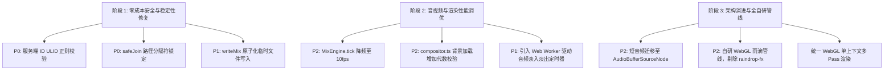

# VoiceStream 架构审计与代码评估讨论备忘录

> 文档定位：针对 Opus 修订版《01_工程代码审计与系统架构评估报告》的深度技术复核、逻辑对抗与工程推演。

---

## 1. 对 Opus 修订内容的逐项复核评估

### 1.1 事实纠偏项复核

| 审计项 | Opus 修订结论 | 技术复核与底层逻辑评估 | 判定 |
| :--- | :--- | :--- | :--- |
| **`safeJoin` 前缀绕过** | 修正了触发条件：必须通过 `../` 相对路径跨目录（如 `/sounds/../SoundsWeb/file`）触发，而非简单同级请求 | **完全成立**。`path.resolve("/asset/Sounds", "../SoundsWeb/file")` 得到 `/asset/SoundsWeb/file`。因为 `root` 解析字符串未加尾部 `/`，`startsWith` 计算为 `true`。工程内确实存在被 `.gitignore` 忽略的 `asset/SoundsWeb/` 目录，具备物理利用条件。 | **准确** |
| **Audio 实例生命周期** | 纠正为“单会话内最多 16 个活跃 MediaElementSource，不存在跨会话泄漏” | **基本成立，但需补充硬件释放延迟**。`dropPlayers()` 虽清理了引用并暂停音频，但未显式置空 `audio.src = ""`，且 `MediaElementAudioSourceNode` 无法手动 `disconnect` 释放底层硬件解码器句柄。在 iOS WebKit 下，系统音频通道释放依赖垃圾回收（GC），快速切换混音时瞬时并发实例仍会超出硬件配额。 | **有效（需补充）** |

### 1.2 Opus 新增审计项价值评估

1. **`MixEngine.tick` 的 rAF 60fps 高频重渲染开销（P2 级）**：
   * **逻辑**：`MixEngine.tick` 在播放状态下随浏览器刷新率（60Hz/120Hz）每帧调用 `emit()`，触发 React `setSnap(s)` 导致组件树重渲染。
   * **影响**：进度条更新与时长渲染无需 60fps。此举导致主线程在高频执行虚拟 DOM Diff，加剧低功耗设备发热与主线程抢占。
   * **结论**：高价值性能发现，应立即引入节流（Throttle 100ms）或仅在非线性状态变化时触发全量 `emit`。
2. **`volumeToGain` 响度平方律注释错误（P3 级）**：
   * **逻辑**：$20 \log_{10}(0.5^2) = 20 \log_{10}(0.25) \approx -12.04\text{ dB}$，原代码注释声称“50% 约等于 -6 dB”。
   * **影响**：代码逻辑正确（感知衰减符合平方律），注释计算有误。
3. **ULID 随机性无偏映射推导（P3 级）**：
   * **逻辑**：$256 \pmod{32} = 0$，8 对 1 均匀映射，无模偏差（Modulo Bias），80-bit 随机熵完全保留。
   * **结论**：算法严密性验证通过。

---

## 2. 深度推演：Opus 报告遗漏的深层架构与运行时缺陷

在 Opus 修订版报告之外，经进一步代码链路追踪与运行时推演，发现以下 3 项未被提及的潜在隐患：

### 2.1 异步图像载入竞态导致视效背景错乱 (Race Condition in Background Loading)
* **缺陷位置**：[`src/effects/compositor.ts:115-125`](file:///Users/ic/Project/VoiceStream/src/effects/compositor.ts#L115-L125)
* **源码事实**：
  ```typescript
  setBackground(url: string | null): void {
    if (!url) { this.bgImg = null; return; }
    const img = new Image();
    img.src = url;
    img.onload = () => {
      this.bgImg = img;
    };
  }
  ```
* **失效机理**：
  `EffectCompositor.setBackground` 没有像 `RainGlass.ts` 那样引入 `gen`（代数标记）或取消机制。
  当用户快速切换场景（例如从 A 场景连续点到 B 场景，网络响应时间 A > B），A 的 `onload` 可能在 B 之后触发，导致画布最终被覆盖为旧场景 A 的背景图像。
* **修复方案**：引入自增序列号或 `AbortController` 绑定。

### 2.2 移动端多 WebGL 上下文抢占与丢失保护 (WebGL Context Quota Exhaustion)
* **缺陷位置**：[`src/pages/PlayPage.tsx:181-208`](file:///Users/ic/Project/VoiceStream/src/pages/PlayPage.tsx#L181-L208)
* **物理事实**：
  播放页同时存在 3 个 Canvas：
  1. `EffectCompositor` (Canvas 2D)
  2. `RainGlass` (WebGL 2.0)
  3. `WaterRipple` (WebGL 2.0)
  在 iOS Safari 与低内存 Android 设备上，浏览器对单个 Web 进程的 WebGL Context 上限通常为 8 到 16 个。由于 `RainGlass` 与 `WaterRipple` 为全局常驻或延迟卸载，当页面在 Library 与 Play 之间频繁切换时，容易触发 WebGL 上下文强制丢失（Context Lost）。
* **防御建议**：统一图形管线，将雨滴折射与水面波纹合并至单 WebGL 2.0 上下文中执行多 Pass 渲染。

### 2.3 移动端 AudioContext 激活链与 Autoplay 限制边界 (User Gesture Chain)
* **缺陷位置**：[`src/pages/PlayPage.tsx:273-283`](file:///Users/ic/Project/VoiceStream/src/pages/PlayPage.tsx#L273-L283)
* **物理事实**：
  代码在全局监听 `pointerdown` / `keydown` 触发 `engine.arm()`。但在部分移动端 WebKit 实现中，若在手势事件回调中仅调用 `ctx.resume()` 而未实际同步创建并启动任何 `AudioNode`，后续异步拉取配置后触发的 `engine.start()` 仍会被安全策略判定为非用户手势触发而处于 `suspended` 状态。
* **防御建议**：在 `arm()` 中播放一个持续 1 采样点的无声 Buffer（Silent Buffer Kickstart）以彻底解锁硬件音频管线。

---

## 3. 架构优化路线图与落地建议



### 3.1 立即实施动作（30 行代码内完成）
1. **`server/index.ts`**：在 `mixes/:id` 路由前注入中间件：
   ```typescript
   const ULID_RE = /^[0-9A-HJKMNPQRSTVWXYZ]{26}$/i;
   app.use("/api/mixes/:id", async (c, next) => {
     if (!ULID_RE.test(c.req.param("id"))) return c.json({ error: "invalid_id" }, 400);
     await next();
   });
   ```
2. **`server/static.ts`**：
   ```typescript
   function safeJoin(root: string, rel: string): string | null {
     const rootResolved = path.resolve(root) + path.sep;
     const targetResolved = path.resolve(root, rel);
     if (targetResolved !== path.resolve(root) && !targetResolved.startsWith(rootResolved)) {
       return null;
     }
     return targetResolved;
   }
   ```
3. **`server/mixes.ts`**：
   ```typescript
   const tmp = path.join(dir, `mix.json.tmp.${Date.now()}`);
   writeFileSync(tmp, JSON.stringify(parsed, null, 2) + "\n");
   renameSync(tmp, dest);
   ```
